# 毕业论文（设计）

**题    目** 基于SpringBoot+Vue的高校学生心理健康智能干预平台的设计与实现

**学生姓名** XXX **学  号** 232204XX

**学    院** 理工学院

**专    业** 计算机科学与技术

**指导教师** XXX **职  称** 副教授

**完成时间** 2026年 6月

**吉首大学张家界学院教务处制**

***

# 基于SpringBoot+Vue的高校学生心理健康智能干预平台的设计与实现

## 摘  要

当代大学生面临着学业压力、人际关系、职业发展等多重挑战，心理健康问题日益凸显。传统心理健康管理模式存在信息化程度低、干预时效性差、资源配置效率低等痛点。本系统针对高校心理健康教育场景设计智能化干预平台，通过智能辅助技术与多维度风险评估体系提升心理健康服务能效与决策数据支撑。

本系统采用前后端分离架构，前端利用Vue3构建简洁美观、交互性强的管理界面，结合uni-app实现移动端跨平台应用，组件化开发模式使界面易于维护和扩展，显著提升用户体验。后端以SpringBoot为基础，以强大的业务逻辑处理能力和数据持久化功能，快速构建稳定可靠的服务。系统架构包含智能聊天、心理评估管理、问卷题库管理、心理干预流程四大核心模块，构建统一管控平台，便于管理员对系统信息进行管理。同时，系统集成Spring AI Alibaba框架，实现智能心理陪伴与风险预警，为心理干预决策提供实时数据洞察。

与市场现有系统相比，本系统在智能化程度、干预时效性和用户体验上有显著提升。采用高效的Redis缓存机制和优化的数据库查询，确保系统响应迅速。严格的权限管理和数据加密，保障学生隐私安全。

**关键词**：心理健康管理系统、SpringBoot、Vue3、智能干预、前后端分离架构

***

## Design and Implementation of College Student Mental Health Intelligent Intervention Platform Based on SpringBoot+Vue

## Abstract

Contemporary college students face multiple challenges including academic pressure, interpersonal relationships, and career development, making mental health issues increasingly prominent. Traditional mental health management models suffer from low informatization, poor intervention timeliness, and inefficient resource allocation. This system designs an intelligent intervention platform for college mental health education scenarios, improving service efficiency and decision data support through intelligent assisted technology and multi-dimensional risk assessment systems.

The system adopts a front-end and back-end separated architecture. The front-end uses Vue3 to build a concise, beautiful, and interactive management interface, combined with uni-app for cross-platform mobile applications. Its component-based development model makes the interface easy to maintain and extend, significantly improving user experience. The back-end, based on SpringBoot, uses powerful business logic processing capabilities and data persistence functions to quickly build stable and reliable services. The system architecture includes four core modules: intelligent chat, psychological assessment management, questionnaire bank management, and psychological intervention process. It builds a unified management and control platform to facilitate administrators in managing system information. Meanwhile, the system integrates Spring AI Alibaba framework to achieve intelligent psychological companionship and risk warning, providing real-time data insights for mental intervention decision-making.

Compared with existing systems in the market, this system has significant improvements in intelligence level, intervention timeliness, and user experience. Adopting efficient Redis caching mechanisms and optimized database queries ensures rapid system response; strict permission management and data encryption ensure student privacy and security.

**Keywords**: Mental Health Management System, SpringBoot, Vue3, Intelligent Intervention, Front-end and Back-end Separation Architecture

***

## 目  录

[摘要](#摘-要) I

[Abstract](#abstract) II

[第1章 前言](#第1章-前言) 1

[1.1 选题背景和意义](#11-选题背景和意义) 1

[1.2 国内外研究现状](#12-国内外研究现状) 2

[1.3 项目目标和范围](#13-项目目标和范围) 4

[第2章 技术与原理](#第2章-技术与原理) 6

[2.1 SpringBoot](#21-springboot) 6

[2.2 Vue3](#22-vue3) 7

[2.3 Element Plus](#23-element-plus) 8

[2.4 uni-app](#24-uni-app) 9

[2.5 MySQL](#25-mysql) 10

[2.6 Redis](#26-redis) 11

[2.7 Spring AI Alibaba框架](#27-spring-ai-alibaba框架) 12

[第3章 系统分析](#第3章-系统分析) 14

[3.1 可行性分析](#31-可行性分析) 14

[3.1.1 经济可行性](#311-经济可行性) 14

[3.1.2 操作可行性](#312-操作可行性) 14

[3.1.3 技术可行性](#313-技术可行性) 15

[3.1.4 运行可行性](#314-运行可行性) 15

[3.2 需求分析](#32-需求分析) 16

[3.2.1 功能需求](#321-功能需求) 16

[3.2.2 非功能需求](#322-非功能需求) 19

[第4章 系统设计](#第4章-系统设计) 21

[4.1 系统架构设计](#41-系统架构设计) 21

[4.2 主要功能设计](#42-主要功能设计) 22

[4.2.1 智能聊天功能设计](#421-智能聊天功能设计) 22

[4.2.2 心理评估管理功能设计](#422-心理评估管理功能设计) 23

[4.2.3 问卷题库管理功能设计](#423-问卷题库管理功能设计) 24

[4.2.4 心理干预管理功能设计](#424-心理干预管理功能设计) 25

[4.2.5 内容推荐功能设计](#425-内容推荐功能设计) 26

[4.2.6 社区互动功能设计](#426-社区互动功能设计) 26

[4.2.7 系统管理功能设计](#427-系统管理功能设计) 27

[4.3 数据库设计](#43-数据库设计) 28

[4.3.1 概念结构设计](#431-概念结构设计) 28

[4.3.2 逻辑结构设计](#432-逻辑结构设计) 32

[第5章 系统实现](#第5章-系统实现) 44

[5.1 后端功能模块](#51-后端功能模块) 44

[5.1.1 智能聊天功能实现](#511-智能聊天功能实现) 44

[5.1.2 心理评估管理功能实现](#512-心理评估管理功能实现) 50

[5.1.3 心理干预管理功能实现](#513-心理干预管理功能实现) 54

[5.1.4 内容推荐功能实现](#514-内容推荐功能实现) 57

[5.2 前端功能模块](#52-前端功能模块) 59

[5.2.1 管理端功能实现](#521-管理端功能实现) 59

[5.2.2 移动端功能实现](#522-移动端功能实现) 62

[第6章 测试与部署](#第6章-测试与部署) 65

[6.1 系统运行环境](#61-系统运行环境) 65

[6.1.1 硬件环境](#611-硬件环境) 65

[6.1.2 软件环境](#612-软件环境) 65

[6.2 系统部署过程](#62-系统部署过程) 66

[6.3 系统测试](#63-系统测试) 67

[6.3.1 登录功能测试](#631-登录功能测试) 67

[6.3.2 智能聊天功能测试](#632-智能聊天功能测试) 69

[6.3.3 问卷管理功能测试](#633-问卷管理功能测试) 70

[6.3.4 评估结果管理功能测试](#634-评估结果管理功能测试) 71

[6.3.5 干预通知功能测试](#635-干预通知功能测试) 72

[第7章 总结](#第7章-总结) 74

[参考文献](#参考文献) 76

[致  谢](#致-谢) 78

***

## 第1章 前言

### 1.1 选题背景和意义

伴随着信息技术在教育领域的广泛应用，高校学生心理健康问题已成为社会关注的焦点\[1]。根据中国科学院心理研究所发布的《中国国民心理健康发展报告》，大学生群体心理健康问题检出率呈上升趋势，学业压力、情感困惑、就业焦虑等因素严重影响了学生的健康成长\[1]。传统心理健康管理模式主要依赖线下咨询，存在预约周期长，服务覆盖面窄，数据孤岛等突出问题，难以满足新时代高校心理健康服务需求\[2]\[3]。

国家教育部高度重视高校心理健康教育工作，先后出台《高等学校学生心理健康教育指导纲要》《关于加强和改进新时代学生心理健康工作的意见》等政策文件，明确提出要构建学校、家庭、社会和相关部门协同联动的心理健康教育工作格局，推动心理健康教育信息化、智能化发展\[4]\[5]。高校学生心理健康智能干预平台通过数字化手段，实现心理健康服务的规模化、精准化、智能化推送，有效缓解了心理辅导员资源不足的困境\[6]。

学生心理健康管理系统通过智能化数据管理，有效降低了人工记录的错误率，同时确保了信息的精确性和实时更新。系统通过集成多维度数据资源，为学校决策提供重要支撑，如学生心理危机预警、干预效果评估、资源优化配置等应用场景。该系统通过智能化的信息处理技术，助力学校实现心理服务资源与学生需求的最优匹配，推动心理健康服务精准化配置。

当前高校心理健康管理系统的界面交互设计存在一定优化空间，主要体现在可视化呈现与个性化适配两方面：界面元素的空间布局未充分遵循用户操作习惯，信息层级结构稍显复杂，导致用户在功能定位时需要进行较多的认知判断。同时系统尚未提供界面主题、功能模块排序、操作快捷方式等个性化配置功能，难以满足不同使用角色（如学生、辅导员、管理员）的差异化操作需求。系统在安全架构层面存在双重缺陷，未建立完善的数据加密体系与多层级访问权限管控，致使学生敏感信息暴露风险显著提升，在隐私保护规范性方面存在治理漏洞。

系统通过部署数据加密机制、构建分级访问控制体系、实施严格的权限管理策略等方式，有效保障数据安全及学生隐私。自行开发可以确保系统包含所有必需的功能，并且可以根据用户反馈不断迭代更新。遵循现代化设计规范构建响应式界面，集成JWT认证与RBAC权限模型保障数据安全。可以根据预期的用户量和数据量优化系统性能，确保系统的稳定性。设计系统时充分考量扩展性，让系统在未来能够轻松添加新功能或者完成升级。同时，通过开展培训与教育工作，提升用户对新系统的接受程度。

### 1.2 国内外研究现状

传统的心理健康管理多依赖于纸质档案或简单的电子表格，随着高校规模扩大和信息处理复杂度提升，这种方式在数据存储、查询与分析上暴露出诸多弊端\[7]。现代化的心理健康管理系统逐步从单机版发展到网络版，功能也从单一走向集成，以满足高校高效管理需求\[8]。

国内众多研究致力于将新技术融入心理健康管理系统中，特别是讨论人工智能技术的应用，旨在通过其强大的自然语言处理能力，来加强学生心理状态的智能分析和预警\[9]\[10]。国内清华大学相关研究团队提出基于机器学习的心理危机预警方案，通过分析学生的行为数据、学业表现、社交活动等多维信息，构建心理风险评估模型，实现学生心理危机的早期识别与干预\[11]\[12]。同时，对智能聊天机器人技术的研究也在不断深入，如利用大语言模型技术实现心理陪伴与智能问答功能，为学生提供7×24小时的心理支持服务，显著提升了心理健康服务的可及性和时效性\[13]。随着个性化教育理念的深入，国内对心理健康管理系统个性化支持功能的研究逐渐增多。研究方向聚焦于学生心理行为数据的深度分析，旨在构建个性化心理干预支持系统\[14]\[15]。

国外在心理健康管理系统中，积极推进大数据与云计算技术的深度融合\[16]。欧美发达国家高校已普遍采用云原生方案处理海量心理数据\[17]。斯坦福大学通过构建基于云计算的心理健康管理架构，整合学生的心理咨询记录、测评结果、干预过程等多源数据。借助大数据分析技术，挖掘学生心理状态变化趋势，为个性化干预提供精准数据支持，预测心理危机风险并提前干预，提升心理健康服务质量与学生留存率\[18]。

教育科技企业通过研发创新的心理健康管理系统产品，参与市场竞争。企业根据高校需求不断优化产品功能，通过市场宣传、产品演示等方式，将产品推向全球市场。该系统在心理健康服务与干预资源优化配置方面展现出显著优势，为全球高校提供了可复制的数字化转型范式，有效促进了全球高校心理健康管理数字化进程。

### 1.3 项目目标和范围

本项目基于SpringBoot与Vue搭建高校学生心理健康智能干预平台。后端利用SpringBoot自动配置和起步依赖特性，快速搭建系统框架，连接MySQL数据库存储心理数据，开发RESTful API接口保障前端数据交互顺畅，处理大量数据。前端借助Vue3的组件化模式，结合Vue Router与Pinia状态管理，实现页面高效渲染，提升操作体验。移动端采用uni-app框架，实现跨平台编译，兼容微信小程序和H5页面。

系统包含智能智能聊天，心理评估管理、问卷题库管理，心理干预管理，内容推荐和社区互动模块。开发时加密敏感信息，保护学生隐私。对高校心理健康教育机构，能提升服务效率、辅助危机预警、优化资源配置。对学生，提供个性化心理支持、随时获取心理知识、方便预约咨询服务。对教育信息化，推动智能技术在心理健康领域的创新应用，促进产学研合作，助力教育现代化发展。

***

## 第2章 技术与原理

### 2.1 SpringBoot

SpringBoot作为Spring生态的轻量级解决方案，通过starter依赖自动装配机制实现零XML配置开发。在本项目中，参考国外高校运用云计算提升系统性能的思路，借助SpringBoot构建高效稳定的后端服务。利用其自动配置和起步依赖特性，快速搭建系统框架，连接MySQL数据库与Redis数据库，实现对学生心理数据的存储与管理。该架构方案在保障前端高效数据交互的同时，通过构建分层的数据处理体系，能够满足高校对学生心理行为数据的处理需求。

SpringBoot3.x版本带来了重大升级，包括对Java17的原生支持、更好的性能优化以及更简洁的配置方式。本系统使用SpringBoot3.5.4版本，结合Spring Security实现安全认证，通过Spring Data JPA与MyBatis Plus实现数据持久化层的高效开发。系统采用分层架构设计，包括控制层（Controller）、服务层（Service）、数据访问层（Mapper/Repository），实现了业务逻辑的高内聚低耦合，便于后期维护和功能扩展。

### 2.2 Vue3

Vue3是Vue.js的新一代版本，其在性能、开发体验等多方面实现重大升级。它基于Proxy替代Object.defineProperty可以实现更高效的响应式系统，通过数据劫持机制，加快了数据响应速度并优化了应用性能。Vue3引入了CompositionAPI，让开发者能更灵活地组织和复用代码逻辑，相较于Vue2的OptionsAPI，它打破了原有的代码组织方式，开发者可按功能逻辑将相关代码聚合，提高代码的可维护性与可复用性。同时，Vue3的虚拟DOM进行了优化，渲染速度更快，减少了内存占用。Vue3的Teleport和Suspense特性在组件化开发中发挥重要作用：Teleport支持将组件渲染至指定DOM节点，Suspense可优化异步组件加载体验，二者协同简化复杂交互界面的构建。

在本系统前端开发中，这些特性被用于构建心理评估、心理干预等核心组件，通过精准控制渲染位置和异步加载逻辑，有效提升页面渲染与交互响应性能。Vue3的响应式系统配合Pinia状态管理，使得全局状态如用户信息、聊天记录、评估结果等的维护变得简单高效。组件化开发模式让心理测评问卷、聊天界面、评估结果图表等复杂组件可以被复用，提高了开发效率。

### 2.3 Element Plus

Element Plus是一套为Vue3打造的桌面端组件库，提供了丰富的企业级UI组件。本系统使用Element Plus构建管理后台的界面，主要原因包括：组件丰富，提供了表格、表单、对话框、导航菜单等企业应用常见组件。设计美观，符合现代企业应用的审美标准。文档完善，便于开发人员快速上手。持续维护，社区活跃，长期支持有保障。

Element Plus的表格组件（el-table）支持分页、排序、筛选、斑马纹等功能，非常适合心理评估结果、学生档案等数据展示场景。表单组件（el-form）提供了完善的数据验证机制，支持对问卷答案、用户输入等进行合法性校验。对话框组件（el-dialog）用于创建模态窗口，实现添加问卷、编辑学生信息等功能。消息提示（el-message、el-messageBox）用于向用户反馈操作结果，提升用户体验。

### 2.4 uni-app

uni-app基于Vue技术栈实现跨端编译，支持微信小程序/H5/Android/iOS多平台自适应渲染。其核心优势在于大幅降低开发成本，开发团队无需为不同平台分别编写代码，通过一次开发即可多端部署，极大地提升了开发效率。uni-app基于Vue.js构建，充分利用了Vue的响应式数据绑定和组件化系统，开发者能轻松构建可复用的UI组件，实现高效的页面渲染与交互。uni-app通过丰富的原生插件支持调用摄像头、GPS定位等设备功能，实现原生功能与Web开发的无缝衔接。

在本系统移动端拓展中，该框架可快速构建适配手机端的心理评估、智能聊天、预约咨询等模块，为师生移动办公场景提供便捷服务。学生可以通过手机随时随地与智能进行心理对话，完成心理测评问卷，查看评估结果，预约心理辅导员，极大提升了心理健康服务的可及性和便利性。

### 2.5 MySQL

MySQL依托InnoDB存储引擎提供ACID事务支持，其主从复制与集群方案满足高并发场景需求。在本高校学生心理健康智能干预平台中，MySQL凭借其成熟的存储引擎，如InnoDB和MyISAM，前者支持事务处理、行级锁，确保数据完整性和并发控制，适用于学生心理数据、评估记录等频繁读写操作。后者则在查询性能上表现出色，可用于处理如心理统计报表这类只读场景。

本系统设计了39张数据库表，涵盖智能聊天会话、心理评估问卷、干预流程记录等核心业务数据。数据库设计遵循第三范式，通过合理的主外键关系建立表间关联，既保证了数据一致性，又避免了数据冗余。关键业务表如evaluation\_result（评估结果表）存储学生的心理测评得分和智能分析结果，intervention\_notification（干预通知表）记录心理危机的预警和干预信息，ai\_chat\_message（智能聊天消息表）保存学生与智能的对话内容，为后续数据分析提供支撑。

### 2.6 Redis

Redis采用单线程Reactor模型保证高性能。在本系统中实现热点数据缓存与会话管理。例如，将频繁查询的学生基本信息或热门问卷数据缓存起来，当用户再次请求时，能直接从Redis内存中快速读取，无需重复访问MySQL数据库，显著减少数据读取时间，加快系统响应速度。同时，Redis拥有出色的高并发读写性能，能有效处理大量用户同时访问的情况，确保系统在高负载下依然稳定运行。

本系统使用Redis实现多项核心功能：JWT令牌缓存，将用户Token存储在Redis中并设置过期时间，实现无状态认证的同时支持Token主动失效。智能聊天会话缓存，保存当前会话的上下文信息，确保流式对话的连贯性。热点数据缓存，将热门心理测评问卷、推荐内容等高频访问数据缓存，提升系统响应速度。Redis还支持数据持久化，为了在系统故障或重启时数据不丢失，应用快照（Snapshotting）和AOF（Append-Only File）等持久化方式，为海量心理数据存储与管理构建可靠的数据底座。

### 2.7 Spring AI Alibaba

Spring AI Alibaba是Spring生态系统中专注于智能应用开发的框架，它封装了对阿里云通义千问大模型的调用能力，为Java开发者提供了简洁易用的智能集成方案。在本系统中，Spring AI Alibaba框架实现了智能心理陪伴聊天功能。开发者无需直接处理复杂的HTTP请求和响应解析，通过框架提供的统一API即可实现与大模型的交互。

在智能聊天模块中，系统将学生的提问通过Spring AI Alibaba框架发送给通义千问模型，框架根据预设的心理陪伴提示词（Prompt）生成符合心理健康服务要求的回复。通过流式输出（Server-Sent Events）技术，实现类似真人对话的逐字显示效果，提升交互体验。Spring AI Alibaba还支持对话上下文管理，能够记住之前的对话内容，实现连贯的多轮对话，让智能更像一位耐心的心理陪伴者。

该框架具有以下优势：简化开发流程，通过简洁的API实现与大模型的对接，降低了智能应用的开发门槛。功能完善，支持流式输出、对话上下文管理、提示词模板等常用功能。性能优异，框架底层优化了网络通信和数据处理，确保响应速度。灵活扩展，支持根据业务需求切换不同版本的模型或接入其他大模型。

***

## 第3章 系统分析

### 3.1 可行性分析

#### 3.1.1 经济可行性

从经济方面考虑，项目采用的开发框架与开发路线选择的都是低成本与开源的方案，有效的降低了成本需求。SpringBoot、Vue3、MySQL、Redis等核心技术均为开源免费使用，无需支付昂贵的商业授权费用。Spring AI Alibaba框架提供一定的免费调用额度，足够支撑系统初期的用户使用。服务器方面，可以选择学生优惠的云服务器或使用校园云资源，费用较低。

当前系统能够为高校心理健康教育中心提供高效的服务与支持，提高心理健康管理的效率，降低人工成本。项目有望在一定的时间内获得足够的经济回报和社会效益，所以在经济可行性方面是可行的。

#### 3.1.2 操作可行性

前后端分离架构（SpringBoot+Vue）符合现代化Web应用开发范式，在操作便捷性上，系统表现出色。基于Vue3构建的界面美观且直观，采用响应式设计可适配不同屏幕尺寸，无论是电脑端还是移动端都能流畅使用。系统操作流程符合用户习惯，心理测评的作答、查询、修改等操作简单几步即可完成，对于批量操作也有便捷功能，例如批量导入学生信息，极大提高了操作效率。同时，Vue的双向数据绑定和组件化特性让界面与数据交互流畅，用户操作时能实时看到数据变化，系统还会及时给出操作反馈，让用户清楚了解操作结果。

该系统的培训成本也较低。对于管理员，其操作界面直观易懂，经过简单培训就能熟悉各项功能和操作流程。辅导员使用的学生档案管理、干预记录等功能操作相对简单，简单培训后即可上手。学生进行心理测评、智能聊天、查看结果等操作也很直观，无需过多培训就能熟练使用。

从可维护性角度而言，SpringBoot和Vue都遵循良好的代码结构和设计模式。SpringBoot的分层架构将业务逻辑、数据访问、控制层等分离，便于理解和维护。Vue的组件化开发使得代码可复用性高，易于修改和扩展。综上所述，基于SpringBoot+Vue技术栈开发的高校学生心理健康智能干预平台在实际应用中体现出较高的可操作性。

#### 3.1.3 技术可行性

该系统的前端网页部分使用Vue3框架配合Element Plus搭建项目的页面结构，使用Axios完成网页部分的数据请求。前端的移动端部分使用uni-app进行设计与实现，uni-app具有良好的跨平台开发功能，通过在HBuilder中编写完相关的功能代码实现，利用其跨平台的特性将其编译到chrome浏览器中进行查看。服务端使用SpringBoot配合MyBatis Plus进行实现，通过使用JDBC连接与操作MySQL数据库实现系统的数据存储。

智能智能聊天功能通过集成Spring AI Alibaba框架实现，利用Spring Boot的WebFlux响应式编程支持SSE流式输出。系统还整合了Redis用于缓存和会话管理，提升系统性能和并发处理能力。整体技术选型成熟稳定，社区资源丰富，开发过程中遇到的问题能够通过文档和社区解决。

#### 3.1.4 运行可行性

该系统运行环境要求较低，部署简单，技术成熟稳定。用户界面友好，符合目标用户群体的操作习惯，易于接受和使用。采用MySQL数据库，数据处理快，存储安全。此外，系统管理与维护方便，后期运维成本低。因此，该系统在运行上是完全可行的。

### 3.2 需求分析

#### 3.2.1 功能需求

高校学生心理健康智能干预平台分为三个系统端，学生拥有用户端的功能，辅导员拥有辅导员端的功能，管理员拥有管理端的功能，系统功能结构图如图3-1所示，本系统的功能需求如下所示：

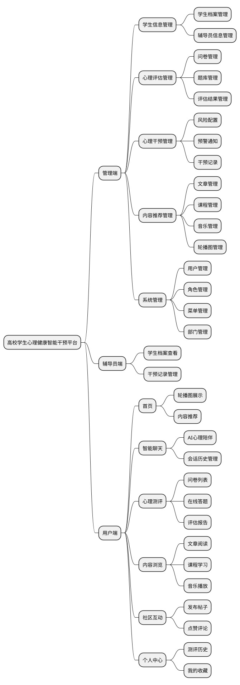
高校学生心理健康智能干预平台分为三个系统端，学生拥有用户端的功能，辅导员拥有辅导员端的功能，管理员拥有管理端的功能，系统功能结构图如图3-1所示，本系统的功能需求如下所示：
1.管理端的功能需求如下：
（1）人员信息管理功能：包含学生档案管理与辅导员信息管理两大模块，档案管理中允许对学生的档案信息进行增删改查，包括学号、姓名、年级，专业、班级、联系方式等基本信息。辅导员信息管理涉及对辅导员信息进行绑定、修改、查询与删除，包括辅导员姓名、联系方式等。
（2）测评管理功能：主要由三部分构成，分别是题库管理、问卷管理、答题管理以及结果管理。题库管理具备对题目信息进行添加、删除、修改和查询的能力，支持选择题和简答题两种题型。在问卷管理方面，它能够对问卷的各项信息进行编辑操作，这些信息包括问卷标题、问卷说明、测评类型、题目数量、总分等内容。在答题管理方面，它能够对学生的答题信息的各项信息进行编辑操作，这些信息包括学生名字、问卷标题、题目类型、题目内容、用户答案等内容。评估结果管理则着重于对学生评估结果数据的查看、智能分析、风险等级标注等操作，以实现对学生心理状态的有效管理。
（3）推荐管理功能：在内容推荐管理功能中包含文章管理、课程管理，音乐管理、轮播图管理等模块，文章管理中能对心理知识文章信息进行增删改查，课程管理可以对在线课程信息进行增删改查，音乐管理用于管理放松音乐资源及其轮播图管理对用户推荐相关宣传图。
（4）干预管理功能：干预管理功能用于实现对学生心理危机预警和干预流程的管理，支持风险配置、预警通知、干预记录等数据的录入、修改及维护操作。
（5）系统管理功能：系统管理功能中包含用户管理、角色管理、菜单管理等部门管理等模块，用户管理功能用于实现系统内用户信息数据的添加、删除、修改及查询操作，支持对用户信息的全面管理。
2.辅导员端的功能需求如下：
（1）学生档案查看：辅导员可以查看所负责学生的基本信息和心理评估记录，了解学生的心理健康状况。
（2）干预记录管理：辅导员可以记录对学生进行心理咨询的详细过程，形成完整的干预档案。
（3）学生端的功能需求如下：
①智能智能聊天：学生可以与智能进行无限制的心理对话，获得全天候的心理陪伴和初步疏导。
②心理测评：学生可以完成系统中的心理测评问卷，获取个性化的评估报告。
③内容推荐：学生可以浏览心理知识文章、在线课程、放松音乐等内容，获取心理健康知识。
④社区互动：学生可以在社区中发帖、评论，与其他学生交流心理健康话题。
⑤个人中心：学生可以查看修改自己的一些个人信息，查看我的音乐、课程和文章的点赞记录。


系统的功能角色分成管理员、辅导员和学生三大类别。学生拥有首页查看、智能聊天、心理测评、内容浏览、社区互动、个人中心等功能。管理员拥有后台管理系统的全部功能包括学生档案管理、辅导员信息管理、问卷管理、题库管理、评估结果管理、干预管理、内容推荐管理、用户管理、角色管理、部门管理等。

### 3.3 系统用例

#### 3.3.1 用例描述

系统用例是对系统功能的抽象描述，展示了系统与不同角色之间的交互。本系统主要包含以下用例：

1. **管理员用例**：
   - 学生信息管理：管理员可以添加、编辑、删除和查询学生信息。
   - 辅导员信息管理：管理员可以添加、编辑、删除和查询辅导员信息。
   - 问卷管理：管理员可以创建、编辑、发布和管理心理测评问卷。
   - 题库管理：管理员可以添加、编辑、删除和管理测评题目。
   - 评估结果管理：管理员可以查看学生的测评结果，触发智能分析生成评估报告。
   - 风险配置管理：管理员可以配置不同风险等级对应的分数区间。
   - 干预通知管理：管理员可以查看和处理干预通知。
   - 干预流程记录：管理员可以记录和管理心理干预流程。
   - 内容推荐管理：管理员可以管理文章、课程、音乐和轮播图。
   - 系统管理：管理员可以管理用户、角色、菜单和部门。

2. **辅导员用例**：
   - 学生档案查看：辅导员可以查看所负责学生的基本信息和心理评估记录。
   - 干预记录管理：辅导员可以记录和管理对学生的心理干预过程。

3. **学生用例**：
   - 智能聊天：学生可以与AI进行心理对话，获得心理陪伴和疏导。
   - 心理测评：学生可以完成心理测评问卷，获取评估报告。
   - 内容浏览：学生可以浏览文章、课程和音乐。
   - 社区互动：学生可以在社区中发帖、评论和点赞。
   - 个人中心：学生可以查看和管理个人信息、测评历史和收藏。

#### 3.3.2 用例图

系统用例图展示了系统与不同角色之间的交互关系，如图3-2所示。

```plantuml
@startuml 系统用例图
skinparam defaultFontName Microsoft YaHei
skinparam roundcorner 5

actor 管理员
actor 辅导员
actor 学生

package "管理端" {
  usecase "学生信息管理"
  usecase "辅导员信息管理"
  usecase "问卷管理"
  usecase "题库管理"
  usecase "评估结果管理"
  usecase "风险配置管理"
  usecase "干预通知管理"
  usecase "干预流程记录"
  usecase "内容推荐管理"
  usecase "系统管理"
}

package "辅导员端" {
  usecase "学生档案查看"
  usecase "干预记录管理"
}

package "学生端" {
  usecase "智能聊天"
  usecase "心理测评"
  usecase "内容浏览"
  usecase "社区互动"
  usecase "个人中心"
}

管理员 --> 学生信息管理
管理员 --> 辅导员信息管理
管理员 --> 问卷管理
管理员 --> 题库管理
管理员 --> 评估结果管理
管理员 --> 风险配置管理
管理员 --> 干预通知管理
管理员 --> 干预流程记录
管理员 --> 内容推荐管理
管理员 --> 系统管理

辅导员 --> 学生档案查看
辅导员 --> 干预记录管理

学生 --> 智能聊天
学生 --> 心理测评
学生 --> 内容浏览
学生 --> 社区互动
学生 --> 个人中心

@enduml
```

#### 3.2.2 非功能需求

（1）性能需求：对于学生、教师和管理员的常见操作，如学生查询测评结果、提交问卷，辅导员查看学生档案，管理员查看用户列表等，系统应在合理时间内给出响应。这要求后端的SpringBoot服务在处理数据库查询和业务逻辑时，优化SQL语句，合理使用缓存（如Redis），减少数据读取和处理时间。前端的Vue应用要优化组件渲染和数据绑定机制，避免因复杂界面交互导致的卡顿。智能聊天功能需要支持流式输出，提升用户交互体验。

（2）可靠性需求：系统在数据录入、存储和传输过程中，要确保数据的准确性。系统通过前端严格的格式验证及后端合法性校验双重机制，有效防止非法数据进入系统。为确保数据操作的原子性、一致性、隔离性和持久性（ACID特性），系统采用了数据库事务处理机制，保障数据操作的完整性和可靠性。对于智能聊天等关键功能，需要实现重试机制和降级策略，确保服务的持续可用。

（3）扩展性需求：系统应具备良好的可扩展性，通过模块化架构设计，支持功能模块的灵活扩展与业务逻辑的动态调整，以适应未来高校业务规模的扩大及需求的变化。在系统架构设计上，采用松耦合的组件化开发模式，SpringBoot的微服务架构便于将不同功能模块拆分为独立的服务，当需要增加新功能时，可独立开发新的微服务并与现有系统集成。Vue前端应用通过组件化管理，方便添加新的页面和交互逻辑，满足新功能的展示和操作需求。

（4）安全性需求：对学生和辅导员的敏感信息，在存储和传输过程中采用加密措施。存储时使用如AES等加密算法对数据进行加密，传输时通过SSL/TLS协议加密数据传输通道，确保数据不被窃取或篡改。系统采用JWT实现无状态认证，支持Token过期自动刷新。实施严格的RBAC权限控制，不同角色只能访问对应的功能和数据范围。

***

## 第4章 系统设计

### 4.1 系统架构设计

系统采用现在主流的前后端分离式开发，首先确定项目的功能，系统应用分为用户端、辅导员端与管理端三个方向，然后确定项目的存储方式，最后编写代码。首先存储方式本项目采用Redis配合MySQL来进行项目实现。然后在项目的用户端采用uni-app配合uni-ui来进行设计与实现。然后管理端的实现采用Vue3与Element-Plus来进行设计与实现，服务端代码采用SpringBoot配合MyBatis-Plus以及Maven来进行设计与实现，前端与服务端的数据交互采用Axios进行实现，服务端与数据库的交互采用MyBatis-Plus进行实现。

系统整体采用B/S架构，从下到上分为基础设施层、数据持久层、业务服务层、应用接口层和前端表现层。基础设施层包括MySQL数据库、Redis缓存、阿里云OSS对象存储、Spring AI Alibaba大模型服务。数据持久层使用MyBatis-Plus实现对象关系映射。业务服务层包含智能聊天服务，心理评估服务，心理干预服务，内容推荐服务等核心业务模块。应用接口层提供RESTful风格的Web API，采用Swagger/OpenAPI规范生成接口文档。前端表现层分为管理后台（Vue3+Element Plus）和移动端（uni-app）两个客户端。

### 4.2 主要功能设计

#### 4.2.1 智能聊天功能设计

智能聊天功能设计分为两个方面，一方面是对学生的心理陪伴对话，实现无限制的倾诉和初步心理疏导。另一方面是对会话历史的管理，学生可以查看之前的聊天记录，也可以创建新的会话。智能通过理解学生的情感表达，进行共情回应，并提供适当的心理建议。

系统通过集成Spring AI Alibaba框架实现智能对话功能。前端使用SSE（Server-Sent Events）技术接收流式响应，实现类似真人聊天的逐字显示效果。系统预设了专业的心理陪伴Prompt，引导智能以温暖、耐心的方式与学生交流，同时确保智能不会生成有害内容。

当学生发送消息时，系统首先将用户消息保存到数据库，然后调用大模型API获取回复，最后将回复内容也保存到数据库，实现聊天记录的永久存储。智能聊天功能流程如图4-2所示。

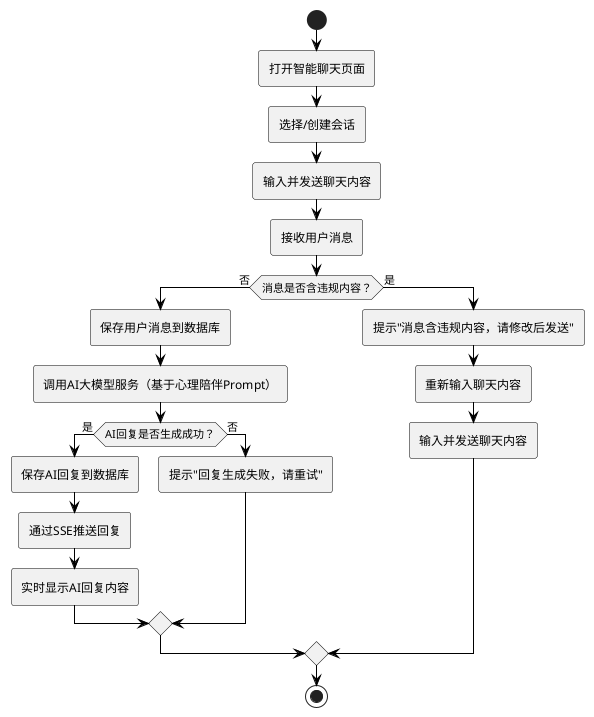

#### 4.2.2 心理测评功能设计

心理测评功能是系统的核心功能之一，允许学生在线完成心理测评问卷，系统自动计算得分并生成评估报告。该功能包括问卷列表展示、在线答题、评估报告生成等模块。

学生通过移动端进入心理测评模块，首先看到待填问卷和已完成问卷的列表，系统会显示问卷的基本信息、截止时间和完成状态。学生选择问卷后进入答题页面，系统会逐题展示题目，支持选择题和简答题两种类型。答题过程中，系统实时保存答案并显示答题进度。

答题完成后，学生提交答案，系统自动计算得分并生成评估报告。评估报告包含总得分、风险等级、智能分析和建议等内容。系统会根据得分自动标注风险等级，便于及时发现需要关注的学生。

心理测评功能流程如图4-2.1所示。

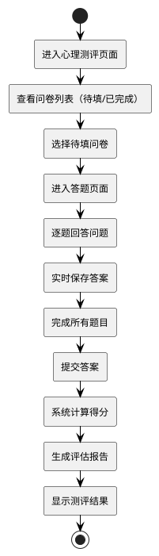

#### 4.2.3 问卷管理功能设计

问卷管理功能允许管理员创建、编辑和管理心理测评问卷。管理员可以设置问卷的基本信息，包括标题、描述、类型、开始时间和结束时间等。系统支持多种问卷类型，如常规测评、临时测评、专项测评等。

当问卷绑定了题目后，系统会禁止删除操作，只能进行修改，以防止数据错误。管理员可以查看问卷的详细信息，包括绑定的题目列表。问卷管理功能流程如图4-3所示。

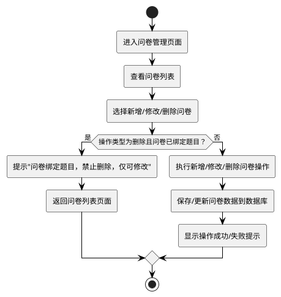

#### 4.2.3 题库管理功能设计

题库管理功能维护一个统一的心理测评题目库，支持选择题和简答题两种类型。管理员可以添加、编辑和删除题目，设置题目内容、选项和分值等。题目库中的题目可以被多个问卷引用，提高了题目复用性。

题库管理功能流程如图4-4所示。

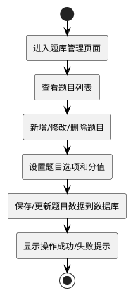

#### 4.2.4 评估结果管理功能设计

评估结果管理功能用于查看和管理学生的心理测评结果。管理员可以查看学生的答题详情、得分情况，并触发智能分析生成评估报告。系统会根据得分自动标注风险等级，便于及时发现需要关注的学生。

评估结果管理功能流程如图4-5所示。

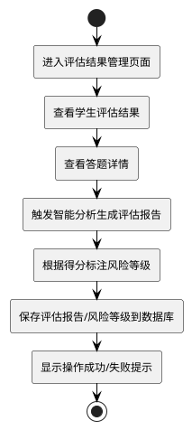

#### 4.2.5 心理干预管理功能设计

心理干预管理功能主要包括风险配置管理、干预通知管理和干预流程记录三个部分。风险配置管理允许管理员设置不同风险等级对应的分数区间和预警规则。干预通知管理用于查看和处理需要心理干预的学生通知。干预流程记录用于记录对学生进行心理干预的全过程，包括干预方式、内容和效果等。

心理干预管理功能流程如图4-6所示。

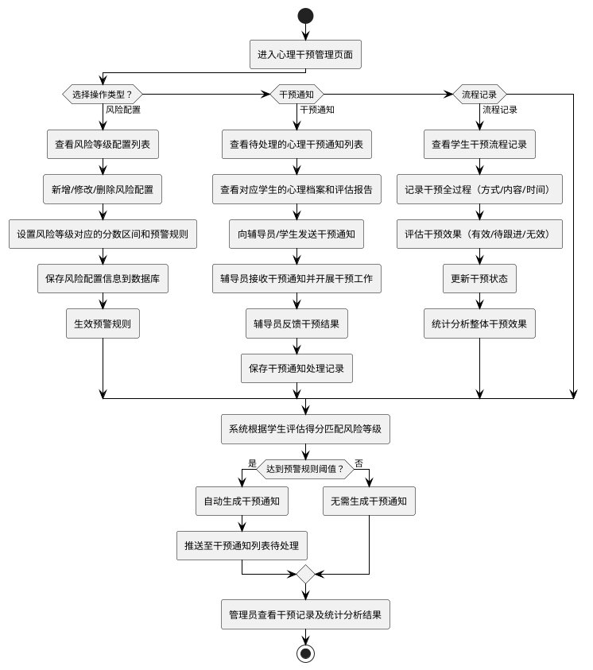

#### 4.2.6 内容推荐功能设计

内容推荐功能允许管理员管理心理知识文章、在线课程、放松音乐和首页轮播图等内容。这些内容会推荐给学生，帮助学生学习心理健康知识，进行心理调适。学生可以浏览、收藏这些内容，管理员可以统计内容的阅读量和点赞量。

内容推荐功能流程如图4-7所示。

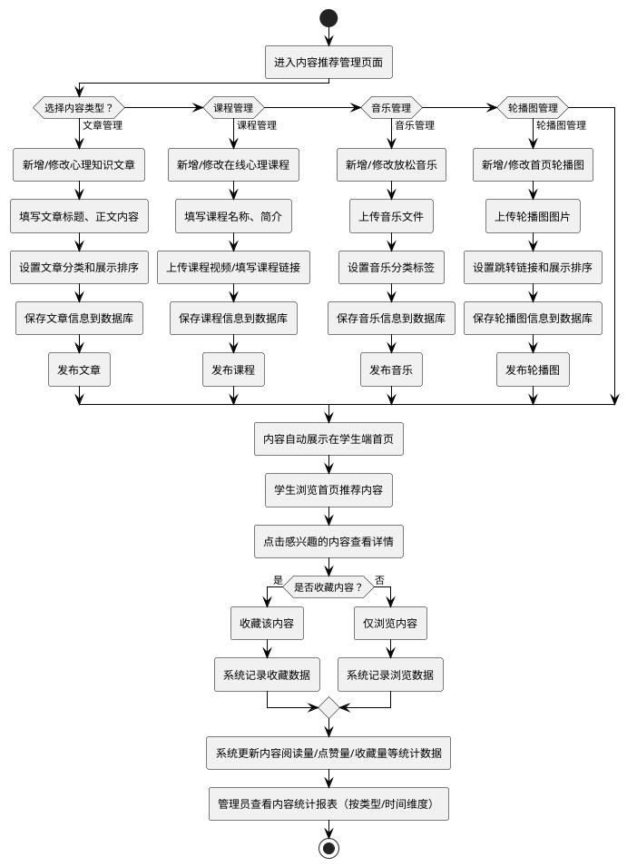

#### 4.2.7 社区互动功能设计

社区互动功能的设计主要是学生可以在社区中发布帖子，分享心理健康相关的内容。其他学生可以对帖子进行点赞、评论。管理员可以管理社区内容，对违规内容进行删除处理。社区互动为学生提供了一个相互支持和交流的平台，有助于形成良好的校园心理健康氛围。社区互动功能流程如图4-8所示。

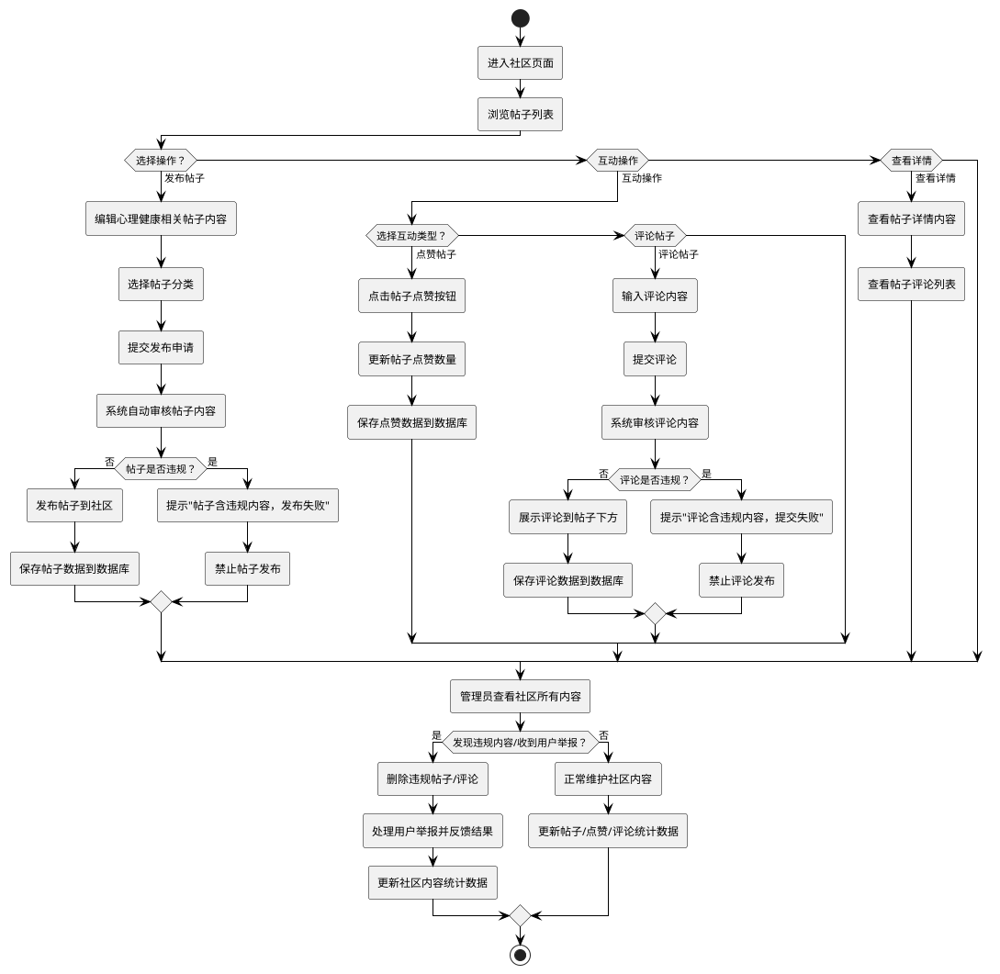

#### 4.2.8 系统管理功能设计

系统管理的功能设计分成多部分：用户管理用于管理系统中的用户账号，支持对用户信息进行增删改操作，对密码进行重置。角色管理用于定义不同的用户角色，如管理员、辅导员、学生，并配置每个角色的权限。菜单管理用于配置管理后台的左侧导航菜单。部门管理用于维护学校的组织架构。日志管理记录用户的操作日志，便于审计和追溯。系统管理功能流程如图4-9所示。

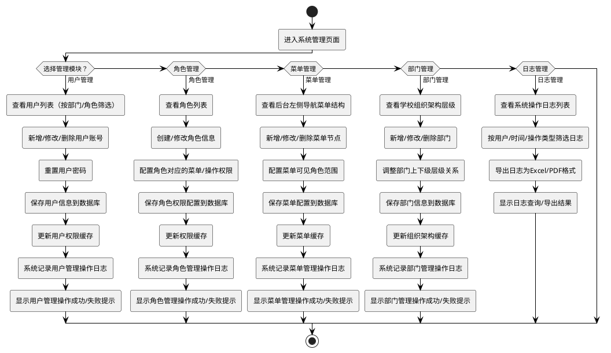

### 4.3 数据库设计

#### 4.3.1 概念结构设计

概念结构设计是数据库设计的重要环节，通过实体-关系模型（E-R模型）来描述系统中的数据实体及其相互关系。本系统核心实体共有13个：

（1）用户实体，承担着记录系统内用户相关信息的职责。它所包含的属性十分全面，首先用户id，部门id、账户名称、用户昵称、用户类型、用户邮箱、用户手机号、用户性别，再是头像链接地址、用户密码、账户状态标识、删除标志、最后登录IP地址、最后登录时间、创建者信息、修改者信息以及更新时间等。如图4-10所示。

图4-10 用户实体属性图

```sql
CREATE TABLE `sys_user` (
  `user_id` bigint(20) NOT NULL AUTO_INCREMENT COMMENT '用户ID',
  `dept_id` bigint(20) DEFAULT NULL COMMENT '部门ID',
  `user_name` varchar(30) NOT NULL COMMENT '用户账号',
  `nick_name` varchar(30) DEFAULT NULL COMMENT '用户昵称',
  `user_type` varchar(2) DEFAULT NULL COMMENT '用户类型',
  `email` varchar(50) DEFAULT NULL COMMENT '用户邮箱',
  `phonenumber` varchar(11) DEFAULT NULL COMMENT '手机号码',
  `sex` char(1) DEFAULT NULL COMMENT '用户性别',
  `avatar` varchar(100) DEFAULT NULL COMMENT '头像地址',
  `password` varchar(100) DEFAULT NULL COMMENT '密码',
  `status` char(1) DEFAULT '0' COMMENT '帐号状态',
  `del_flag` char(1) DEFAULT '0' COMMENT '删除标志',
  `login_ip` varchar(128) DEFAULT NULL COMMENT '最后登录IP',
  `login_date` datetime DEFAULT NULL COMMENT '最后登录时间',
  `create_by` varchar(64) DEFAULT NULL COMMENT '创建者',
  `create_time` datetime DEFAULT NULL COMMENT '创建时间',
  `update_by` varchar(64) DEFAULT NULL COMMENT '更新者',
  `update_time` datetime DEFAULT NULL COMMENT '更新时间',
  PRIMARY KEY (`user_id`)
) ENGINE=InnoDB DEFAULT CHARSET=utf8mb4 COMMENT='用户信息表';
```

（2）学生实体，可实现学校学生档案信息的储存与管控。包括学生的学号、姓名、性别、年级，专业、班级、联系电话、状态、创建时间、更新时间、备注等属性。如图4-10所示。

图4-10 学生实体属性图

```sql
CREATE TABLE `student_info` (
  `student_id` bigint(20) NOT NULL AUTO_INCREMENT COMMENT '学生ID',
  `user_id` bigint(20) DEFAULT NULL COMMENT '用户ID',
  `student_no` varchar(50) DEFAULT NULL COMMENT '学号',
  `name` varchar(50) DEFAULT NULL COMMENT '姓名',
  `gender` char(1) DEFAULT NULL COMMENT '性别',
  `grade` varchar(20) DEFAULT NULL COMMENT '年级',
  `major` varchar(50) DEFAULT NULL COMMENT '专业',
  `class_name` varchar(50) DEFAULT NULL COMMENT '班级',
  `phone` varchar(20) DEFAULT NULL COMMENT '联系电话',
  `status` char(1) DEFAULT '0' COMMENT '状态',
  `create_by` varchar(64) DEFAULT NULL COMMENT '创建者',
  `create_time` datetime DEFAULT NULL COMMENT '创建时间',
  `update_by` varchar(64) DEFAULT NULL COMMENT '更新者',
  `update_time` datetime DEFAULT NULL COMMENT '更新时间',
  `remark` varchar(200) DEFAULT NULL COMMENT '备注',
  PRIMARY KEY (`student_id`)
) ENGINE=InnoDB DEFAULT CHARSET=utf8mb4 COMMENT='学生信息表';
```

（3）辅导员实体，主要承担着记录心理辅导员信息的任务，这些信息用于学生预约咨询和干预工作。辅导员实体涵盖的属性包括辅导员姓名、联系电话、邮箱、办公室地址、状态、创建时间、更新时间等。如图4-11所示。

图4-11 辅导员实体属性图

```sql
CREATE TABLE `counselor_info` (
  `counselor_id` bigint(20) NOT NULL AUTO_INCREMENT COMMENT '辅导员ID',
  `user_id` bigint(20) DEFAULT NULL COMMENT '用户id',
  `name` varchar(50) DEFAULT NULL COMMENT '姓名',
  `phone` varchar(20) DEFAULT NULL COMMENT '联系电话',
  `email` varchar(100) DEFAULT NULL COMMENT '邮箱',
  `office` varchar(100) DEFAULT NULL COMMENT '办公室地址',
  `status` char(1) DEFAULT '0' COMMENT '状态',
  `create_by` varchar(64) DEFAULT '' COMMENT '创建者',
  `create_time` datetime DEFAULT NULL COMMENT '创建时间',
  `update_by` varchar(64) DEFAULT '' COMMENT '更新者',
  `update_time` datetime DEFAULT NULL COMMENT '更新时间',
  `remark` varchar(200) DEFAULT NULL COMMENT '备注',
  PRIMARY KEY (`counselor_id`)
) ENGINE=InnoDB DEFAULT CHARSET=utf8mb4 COMMENT='辅导员信息表';
```

（4）智能会话实体，用来记录学生与智能的聊天会话。包括会话ID、用户ID、会话名称、创建时间、更新时间等属性组成。如图4-12所示。

图4-12 智能会话实体属性图

```sql
CREATE TABLE `ai_chat_session` (
  `session_id` bigint(20) NOT NULL AUTO_INCREMENT COMMENT '会话ID',
  `user_id` bigint(20) DEFAULT NULL COMMENT '用户ID',
  `session_name` varchar(255) DEFAULT NULL COMMENT '会话名称',
  `create_by` varchar(64) DEFAULT '' COMMENT '创建者',
  `create_time` datetime DEFAULT NULL COMMENT '创建时间',
  `update_by` varchar(64) DEFAULT '' COMMENT '更新者',
  `update_time` datetime DEFAULT NULL COMMENT '更新时间',
  `remark` varchar(200) DEFAULT NULL COMMENT '备注',
  PRIMARY KEY (`session_id`)
) ENGINE=InnoDB DEFAULT CHARSET=utf8mb4 COMMENT='AI 聊天会话表';
```

（5）智能消息实体，负责记录学生与智能的每次对话内容。包括消息ID、所属会话ID、用户ID、消息类型（用户/智能）、消息内容、创建时间等属性。如图4-13所示。

图4-13 智能消息实体属性图

```sql
CREATE TABLE `ai_chat_message` (
  `message_id` bigint(20) NOT NULL AUTO_INCREMENT COMMENT '消息ID',
  `session_id` bigint(20) DEFAULT NULL COMMENT '会话ID',
  `user_id` bigint(20) DEFAULT NULL COMMENT '用户ID',
  `message_type` tinyint(1) DEFAULT NULL COMMENT '消息类型',
  `content` text COMMENT '消息内容',
  `create_by` varchar(64) DEFAULT '' COMMENT '创建者',
  `create_time` datetime DEFAULT NULL COMMENT '创建时间',
  `update_by` varchar(64) DEFAULT '' COMMENT '更新者',
  `update_time` datetime DEFAULT NULL COMMENT '更新时间',
  `remark` varchar(200) DEFAULT NULL COMMENT '备注',
  PRIMARY KEY (`message_id`)
) ENGINE=InnoDB DEFAULT CHARSET=utf8mb4 COMMENT='AI 聊天消息表';
```

（6）问卷实体，用于存储心理测评问卷的基本信息，涵盖问卷标题、问卷说明、状态、类型、总分、开始时间、结束时间、创建时间、更新时间等属性。如图4-14所示。

图4-14 问卷实体属性图

```sql
CREATE TABLE `questionnaire` (
  `questionnaire_id` bigint(20) NOT NULL AUTO_INCREMENT COMMENT '问卷ID',
  `title` varchar(200) DEFAULT NULL COMMENT '问卷标题',
  `description` varchar(500) DEFAULT NULL COMMENT '问卷说明',
  `status` char(1) DEFAULT '0' COMMENT '问卷状态',
  `type` char(1) DEFAULT '0' COMMENT '问卷类型',
  `total_score` int(10) DEFAULT '0' COMMENT '问卷总分',
  `start_time` datetime DEFAULT NULL COMMENT '问卷开始时间',
  `end_time` datetime DEFAULT NULL COMMENT '问卷结束时间',
  `create_by` varchar(64) DEFAULT '' COMMENT '创建者',
  `create_time` datetime DEFAULT NULL COMMENT '创建时间',
  `update_by` varchar(64) DEFAULT '' COMMENT '更新者',
  `update_time` datetime DEFAULT NULL COMMENT '更新时间',
  `remark` varchar(200) DEFAULT NULL COMMENT '备注',
  PRIMARY KEY (`questionnaire_id`)
) ENGINE=InnoDB DEFAULT CHARSET=utf8mb4 COMMENT='心理测评问卷表';
```

（7）题目实体，负责储存心理测评题目的具体内容，具体涵盖所属问卷ID、题目类型、题干内容、选项（JSON格式）、标准答案、分值、排序、创建时间、更新时间等各类详细信息。如图4-15所示。

图4-15 题目实体属性图

```sql
CREATE TABLE `question` (
  `question_id` bigint(20) NOT NULL AUTO_INCREMENT COMMENT '题目ID',
  `questionnaire_id` bigint(20) NOT NULL COMMENT '问卷ID',
  `type` varchar(20) NOT NULL COMMENT '题目类型',
  `content` varchar(500) NOT NULL COMMENT '题干内容',
  `options` json DEFAULT NULL COMMENT '选项',
  `standard_answer` varchar(200) DEFAULT NULL COMMENT '标准答案',
  `score` int(10) DEFAULT '0' COMMENT '分值',
  `order_num` int(10) DEFAULT '0' COMMENT '题目顺序',
  `create_by` varchar(64) DEFAULT '' COMMENT '创建者',
  `create_time` datetime DEFAULT NULL COMMENT '创建时间',
  `update_by` varchar(64) DEFAULT '' COMMENT '更新者',
  `update_time` datetime DEFAULT NULL COMMENT '更新时间',
  `remark` varchar(200) DEFAULT NULL COMMENT '备注',
  PRIMARY KEY (`question_id`)
) ENGINE=InnoDB DEFAULT CHARSET=utf8mb4 COMMENT='心理测评题目表';
```

（8）评估结果实体，用于存储学生完成心理测评的结果信息，包含学生ID、问卷ID、总得分、风险等级、智能分析结果（JSON格式）、智能分析状态、已读状态、完成状态、创建时间、更新时间等属性。如图4-16所示。

图4-16 评估结果实体属性图

```sql
CREATE TABLE `evaluation_result` (
  `result_id` bigint(20) NOT NULL AUTO_INCREMENT COMMENT '测评结果ID',
  `student_id` bigint(20) DEFAULT NULL COMMENT '学生ID',
  `questionnaire_id` bigint(20) DEFAULT NULL COMMENT '问卷ID',
  `total_score` int(10) DEFAULT NULL COMMENT '总得分',
  `risk_level` varchar(20) DEFAULT NULL COMMENT '风险等级',
  `ai_analysis` json DEFAULT NULL COMMENT 'AI 分析结果',
  `ai_status` char(1) DEFAULT '0' COMMENT 'AI分析状态',
  `read_status` char(1) DEFAULT '0' COMMENT '已读标识',
  `completion_status` char(1) DEFAULT '0' COMMENT '完成标识',
  `create_by` varchar(64) DEFAULT '' COMMENT '创建者',
  `create_time` datetime DEFAULT NULL COMMENT '创建时间',
  `update_by` varchar(64) DEFAULT '' COMMENT '更新者',
  `update_time` datetime DEFAULT NULL COMMENT '更新时间',
  `remark` varchar(200) DEFAULT NULL COMMENT '备注',
  PRIMARY KEY (`result_id`)
) ENGINE=InnoDB DEFAULT CHARSET=utf8mb4 COMMENT='心理测评结果表';
```

（9）风险配置实体，则用于存储心理风险等级的配置信息。有助于根据不同的评估得分触发相应的预警机制。其包含风险等级、最低分数、最高分数、通知模板、状态、创建时间、更新时间等属性。如图4-17所示。

图4-17 风险配置实体属性图

```sql
CREATE TABLE `intervention_risk_config` (
  `config_id` bigint(20) NOT NULL AUTO_INCREMENT COMMENT '配置ID',
  `risk_level` varchar(20) DEFAULT NULL COMMENT '风险等级',
  `min_score` int(10) DEFAULT NULL COMMENT '最低分数',
  `max_score` int(10) DEFAULT NULL COMMENT '最高分数',
  `notification_template` text COMMENT '通知模板',
  `status` char(1) DEFAULT '0' COMMENT '状态',
  `create_by` varchar(64) DEFAULT '' COMMENT '创建者',
  `create_time` datetime DEFAULT NULL COMMENT '创建时间',
  `update_by` varchar(64) DEFAULT '' COMMENT '更新者',
  `update_time` datetime DEFAULT NULL COMMENT '更新时间',
  `remark` varchar(200) DEFAULT NULL COMMENT '备注',
  PRIMARY KEY (`config_id`),
  UNIQUE KEY `uk_risk_level` (`risk_level`)
) ENGINE=InnoDB DEFAULT CHARSET=utf8mb4 COMMENT='风险等级配置表';
```

（10）干预通知实体，主要用于储存心理干预通知信息，保证相关人员能够及时知晓需要干预的学生情况。其中先是通知ID、关联评估结果ID、学生ID、负责人ID，部门ID、通知类型、通知内容、发送时间、阅读状态、处理状态、创建时间、更新时间等。如图4-18所示。

图4-18 干预通知实体属性图

```sql
CREATE TABLE `intervention_notification` (
  `notification_id` bigint(20) NOT NULL AUTO_INCREMENT COMMENT '通知ID',
  `result_id` bigint(20) DEFAULT NULL COMMENT '评测结果ID',
  `student_id` bigint(20) DEFAULT NULL COMMENT '学生ID',
  `user_id` bigint(20) DEFAULT NULL COMMENT '用户ID',
  `dept_id` bigint(20) DEFAULT NULL COMMENT '部门ID',
  `notification_type` varchar(50) DEFAULT NULL COMMENT '通知类型',
  `notification_content` text COMMENT '通知内容',
  `send_time` datetime DEFAULT NULL COMMENT '发送时间',
  `read_status` char(1) DEFAULT '0' COMMENT '阅读状态',
  `process_status` char(1) DEFAULT '0' COMMENT '处理状态',
  `create_by` varchar(64) DEFAULT '' COMMENT '创建者',
  `create_time` datetime DEFAULT NULL COMMENT '创建时间',
  `update_by` varchar(64) DEFAULT '' COMMENT '更新者',
  `update_time` datetime DEFAULT NULL COMMENT '更新时间',
  `remark` varchar(200) DEFAULT NULL COMMENT '备注',
  PRIMARY KEY (`notification_id`)
) ENGINE=InnoDB DEFAULT CHARSET=utf8mb4 COMMENT='干预通知表';
```

（11）心理文章推荐实体，用于存储推荐给学生的心理知识文章信息，涵盖文章标题、内容、摘要、作者、阅读量、分类、状态、创建时间、更新时间等信息。如图4-19所示。

图4-19 心理文章推荐实体属性图

```sql
CREATE TABLE `recommend_article` (
  `article_id` bigint(20) NOT NULL AUTO_INCREMENT COMMENT '文章ID',
  `title` varchar(100) NOT NULL COMMENT '文章标题',
  `content` text NOT NULL COMMENT '文章内容',
  `summary` varchar(500) DEFAULT NULL COMMENT '文章摘要',
  `author` varchar(64) DEFAULT NULL COMMENT '作者',
  `read_count` int(10) DEFAULT '0' COMMENT '阅读量',
  `category` varchar(50) DEFAULT NULL COMMENT '文章分类',
  `status` char(1) DEFAULT '0' COMMENT '状态',
  `create_by` varchar(64) DEFAULT '' COMMENT '创建者',
  `create_time` datetime DEFAULT CURRENT_TIMESTAMP COMMENT '创建时间',
  `update_by` varchar(64) DEFAULT '' COMMENT '更新者',
  `update_time` datetime DEFAULT CURRENT_TIMESTAMP ON UPDATE CURRENT_TIMESTAMP COMMENT '更新时间',
  `remark` varchar(200) DEFAULT NULL COMMENT '备注',
  PRIMARY KEY (`article_id`)
) ENGINE=InnoDB DEFAULT CHARSET=utf8mb4 COMMENT='心理文章推荐表';
```

（12）心理课程推荐实体，用于存储推荐给学生的心理课程信息，涵盖课程标题、视频链接、封面图、时长、课程简介、状态、创建时间、更新时间等信息。如图4-20所示。

图4-20 心理课程推荐实体属性图

```sql
CREATE TABLE `recommend_course` (
  `course_id` bigint(20) NOT NULL AUTO_INCREMENT COMMENT '课程ID',
  `title` varchar(100) NOT NULL COMMENT '课程标题',
  `mp4_url` varchar(255) NOT NULL COMMENT '视频文件链接',
  `cover_url` varchar(255) DEFAULT NULL COMMENT '封面图链接',
  `duration` int(10) DEFAULT NULL COMMENT '视频时长',
  `description` varchar(500) DEFAULT NULL COMMENT '课程简介',
  `status` char(1) DEFAULT '0' COMMENT '状态',
  `create_by` varchar(64) DEFAULT '' COMMENT '创建者',
  `create_time` datetime DEFAULT CURRENT_TIMESTAMP COMMENT '创建时间',
  `update_by` varchar(64) DEFAULT '' COMMENT '更新者',
  `update_time` datetime DEFAULT CURRENT_TIMESTAMP ON UPDATE CURRENT_TIMESTAMP COMMENT '更新时间',
  `remark` varchar(200) DEFAULT NULL COMMENT '备注',
  PRIMARY KEY (`course_id`)
) ENGINE=InnoDB DEFAULT CHARSET=utf8mb4 COMMENT='心理课程推荐表';
```

（13）心理音乐推荐实体，用于存储推荐给学生的放松音乐资源信息，涵盖音乐标题、音频链接、封面图、艺术家、风格、时长、状态、创建时间、更新时间等信息。如图4-21所示。

图4-21 心理音乐推荐实体属性图

```sql
CREATE TABLE `recommend_music` (
  `music_id` bigint(20) NOT NULL AUTO_INCREMENT COMMENT '音乐ID',
  `title` varchar(100) NOT NULL COMMENT '音乐标题',
  `mp3_url` varchar(255) NOT NULL COMMENT '音频文件链接',
  `cover_url` varchar(255) DEFAULT NULL COMMENT '封面图链接',
  `artist` varchar(64) DEFAULT NULL COMMENT '演唱者/作者',
  `genre` varchar(50) DEFAULT NULL COMMENT '音乐风格',
  `duration` int(10) DEFAULT NULL COMMENT '时长',
  `description` varchar(500) DEFAULT NULL COMMENT '音乐简介',
  `status` char(1) DEFAULT '0' COMMENT '状态',
  `create_by` varchar(64) DEFAULT '' COMMENT '创建者',
  `create_time` datetime DEFAULT CURRENT_TIMESTAMP COMMENT '创建时间',
  `update_by` varchar(64) DEFAULT '' COMMENT '更新者',
  `update_time` datetime DEFAULT CURRENT_TIMESTAMP ON UPDATE CURRENT_TIMESTAMP COMMENT '更新时间',
  `remark` varchar(200) DEFAULT NULL COMMENT '备注',
  PRIMARY KEY (`music_id`)
) ENGINE=InnoDB DEFAULT CHARSET=utf8mb4 COMMENT='心理音乐推荐表';
```

（14）总体关系：系统采用规范化数据建模，构建以下实体映射体系：用户实体与学生实体、辅导员实体形成1:1关联关系，学生实体与评估结果形成1:N双向约束，与智能聊天会话建立1:N级联关系。智能聊天会话与智能消息间定义1:N消息关联。问卷与题目间设置1:N评估关联。评估结果与干预通知间建立1:N预警关联，干预通知与干预处理记录形成1:N处理关联。用户与内容推荐（文章、课程、音乐）间建立N:1发布关系，通过外键级联与事务锁机制保障数据操作的原子性和业务完整性。

#### 4.3.2 逻辑结构设计

（1）用户表（sys\_user）：用于记录当前系统的用户信息，数据结构如表4-1所示。

表4-1 用户表

| 字段           | 类型       | 长度     | 约束             | 备注     |
| ------------ | -------- | ------ | -------------- | ------ |
| user\_id     | bigint   | 20     | 非空、primary key | 用户ID   |
| dept\_id     | bigint   | 20     | 空              | 部门ID   |
| user\_name   | varchar  | 30     | 非空             | 用户账号   |
| nick\_name   | varchar  | 30     | 非空             | 用户昵称   |
| user\_type   | varchar  | 2      | 空              | 用户类型   |
| email        | varchar  | 50     | 空              | 用户邮箱   |
| phonenumber  | varchar  | 11     | 空              | 手机号码   |
| sex          | char     | 1      | 空              | 用户性别   |
| avatar       | varchar  | 100    | 空              | 头像地址   |
| password     | varchar  | 100    | 空              | 密码     |
| status       | char     | 1      | 空              | 账号状态   |
| del\_flag    | char     | 1      | 空              | 删除标志   |
| login\_ip    | varchar  | 128    | 空              | 最后登录IP |
| login\_date  | datetime | <br /> | 空              | 最后登录时间 |
| pwd\_update\_date | datetime | <br /> | 空              | 密码最后更新时间 |
| create\_by   | varchar  | 64     | 空              | 创建者    |
| create\_time | datetime | <br /> | 空              | 创建时间   |
| update\_by   | varchar  | 64     | 空              | 更新者    |
| update\_time | datetime | <br /> | 空              | 更新时间   |
| remark       | varchar  | 500    | 空              | 备注     |

（2）学生信息表（student\_info）：记录当前系统的学生信息，其数据结构如表4-2所示。

表4-2 学生信息表

| 字段           | 类型       | 长度     | 约束             | 备注   |
| ------------ | -------- | ------ | -------------- | ---- |
| student\_id  | bigint   | 20     | primary key、非空 | 学生ID |
| user\_id     | bigint   | 20     | 空              | 用户ID |
| student\_no  | varchar  | 50     | 空              | 学号   |
| name         | varchar  | 50     | 空              | 姓名   |
| gender       | char     | 1      | 空              | 性别   |
| grade        | varchar  | 20     | 空              | 年级   |
| major        | varchar  | 50     | 空              | 专业   |
| class\_name  | varchar  | 50     | 空              | 班级   |
| phone        | varchar  | 20     | 空              | 联系电话 |
| status       | char     | 1      | 空              | 状态   |
| create\_by   | varchar  | 64     | 空              | 创建者  |
| create\_time | datetime | <br /> | 空              | 创建时间 |
| update\_by   | varchar  | 64     | 空              | 更新者  |
| update\_time | datetime | <br /> | 空              | 更新时间 |
| remark       | varchar  | 200    | 空              | 备注   |

（3）辅导员信息表（counselor\_info）：存储所有辅导员的信息，其数据结构如表4-3所示。

表4-3 辅导员信息表

| 字段            | 类型       | 长度     | 约束             | 描述    |
| ------------- | -------- | ------ | -------------- | ----- |
| counselor\_id | bigint   | 20     | primary key、非空 | 辅导员ID |
| user\_id      | bigint   | 20     | 空              | 用户id  |
| name          | varchar  | 50     | 空              | 姓名    |
| phone         | varchar  | 20     | 空              | 联系电话  |
| email         | varchar  | 100    | 空              | 邮箱    |
| office        | varchar  | 100    | 空              | 办公室地址  |
| status        | char     | 1      | 空              | 状态    |
| create\_by    | varchar  | 64     | 空              | 创建者   |
| create\_time  | datetime | <br /> | 空              | 创建时间  |
| update\_by    | varchar  | 64     | 空              | 更新者   |
| update\_time  | datetime | <br /> | 空              | 更新时间  |
| remark        | varchar  | 200    | 空              | 备注    |

（4）智能会话表（ai\_chat\_session）：存储所有学生的智能聊天会话信息，其数据结构如表4-4所示。

表4-4 智能会话表

| 字段            | 类型       | 长度     | 约束             | 描述   |
| ------------- | -------- | ------ | -------------- | ---- |
| session\_id   | bigint   | 20     | primary key、非空 | 会话ID |
| user\_id      | bigint   | 20     | 空              | 用户ID |
| session\_name | varchar  | 255    | 空              | 会话名称 |
| create\_by    | varchar  | 64     | 空              | 创建者  |
| create\_time  | datetime | <br /> | 空              | 创建时间 |
| update\_by    | varchar  | 64     | 空              | 更新者  |
| update\_time  | datetime | <br /> | 空              | 更新时间 |
| remark        | varchar  | 200    | 空              | 备注   |

（5）智能消息表（ai\_chat\_message）：存储所有智能聊天消息内容，其数据结构如表4-5所示。

表4-5 智能消息表

| 字段            | 类型       | 长度     | 约束             | 描述   |
| ------------- | -------- | ------ | -------------- | ---- |
| message\_id   | bigint   | 20     | primary key、非空 | 消息ID |
| session\_id   | bigint   | 20     | 空              | 会话ID |
| user\_id      | bigint   | 20     | 空              | 用户ID |
| message\_type | tinyint  | 1      | 空              | 消息类型 |
| content       | text     | <br /> | 空              | 消息内容 |
| create\_by    | varchar  | 64     | 空              | 创建者  |
| create\_time  | datetime | <br /> | 空              | 创建时间 |
| update\_by    | varchar  | 64     | 空              | 更新者  |
| update\_time  | datetime | <br /> | 空              | 更新时间 |
| remark        | varchar  | 200    | 空              | 备注   |

（6）心理问卷表（questionnaire）：存储所有心理测评问卷信息，其数据结构如表4-6所示。

表4-6 心理问卷表

| 字段                | 类型       | 长度     | 约束             | 描述     |
| ----------------- | -------- | ------ | -------------- | ------ |
| questionnaire\_id | bigint   | 20     | primary key、非空 | 问卷ID   |
| title             | varchar  | 200    | 空              | 问卷标题   |
| description       | varchar  | 500    | 空              | 问卷说明   |
| status            | char     | 1      | 空              | 问卷状态   |
| type              | char     | 1      | 空              | 问卷类型   |
| total\_score      | int      | 10     | 空              | 问卷总分   |
| start\_time       | datetime | <br /> | 空              | 问卷开始时间 |
| end\_time         | datetime | <br /> | 空              | 问卷结束时间 |
| create\_by        | varchar  | 64     | 空              | 创建者    |
| create\_time      | datetime | <br /> | 空              | 创建时间   |
| update\_by        | varchar  | 64     | 空              | 更新者    |
| update\_time      | datetime | <br /> | 空              | 更新时间   |
| remark            | varchar  | 200    | 空              | 备注     |

（7）题目表（question）：存储所有心理测评题目信息，其数据结构如表4-7所示。

表4-7 题目表

| 字段                | 类型       | 长度     | 约束             | 描述   |
| ----------------- | -------- | ------ | -------------- | ---- |
| question\_id      | bigint   | 20     | primary key、非空 | 题目ID |
| questionnaire\_id | bigint   | 20     | 非空             | 问卷ID |
| type              | varchar  | 20     | 非空             | 题目类型 |
| content           | varchar  | 500    | 非空             | 题干内容 |
| options           | json     | <br /> | 空              | 选项 |
| standard\_answer  | varchar  | 200    | 空              | 标准答案 |
| score             | int      | 10     | 空              | 分值   |
| order\_num        | int      | 10     | 空              | 题目顺序 |
| create\_by        | varchar  | 64     | 空              | 创建者  |
| create\_time      | datetime | <br /> | 空              | 创建时间 |
| update\_by        | varchar  | 64     | 空              | 更新者  |
| update\_time      | datetime | <br /> | 空              | 更新时间 |
| remark            | varchar  | 200    | 空              | 备注   |

（8）评估结果表（evaluation\_result）：存储所有学生的评估结果信息，其数据结构如表4-8所示。

表4-8 评估结果表

| 字段                 | 类型       | 长度     | 约束             | 描述     |
| ------------------ | -------- | ------ | -------------- | ------ |
| result\_id         | bigint   | 20     | primary key、非空 | 测评结果ID |
| student\_id        | bigint   | 20     | 空              | 学生ID   |
| questionnaire\_id  | bigint   | 20     | 空              | 问卷ID   |
| total\_score       | int      | 10     | 空              | 总得分    |
| risk\_level        | varchar  | 20     | 空              | 风险等级   |
| ai\_analysis       | json     | <br /> | 空              | AI 分析结果 |
| ai\_status         | char     | 1      | 空              | AI分析状态 |
| read\_status       | char     | 1      | 空              | 已读标识   |
| completion\_status | char     | 1      | 空              | 完成标识   |
| create\_by         | varchar  | 64     | 空              | 创建者    |
| create\_time       | datetime | <br /> | 空              | 创建时间   |
| update\_by         | varchar  | 64     | 空              | 更新者    |
| update\_time       | datetime | <br /> | 空              | 更新时间   |
| remark             | varchar  | 200    | 空              | 备注     |

（9）干预通知表（intervention\_notification）：存储所有干预通知信息，其数据结构如表4-9所示。

表4-9 干预通知表

| 字段                    | 类型       | 长度     | 约束             | 描述     |
| --------------------- | -------- | ------ | -------------- | ------ |
| notification\_id      | bigint   | 20     | primary key、非空 | 通知ID   |
| result\_id            | bigint   | 20     | 空              | 评测结果ID |
| student\_id           | bigint   | 20     | 空              | 学生ID   |
| user\_id              | bigint   | 20     | 空              | 用户ID  |
| dept\_id              | bigint   | 20     | 空              | 部门ID   |
| notification\_type    | varchar  | 50     | 空              | 通知类型   |
| notification\_content | text     | <br /> | 空              | 通知内容   |
| send\_time            | datetime | <br /> | 空              | 发送时间   |
| read\_status          | char     | 1      | 空              | 阅读状态   |
| process\_status       | char     | 1      | 空              | 处理状态   |
| create\_by            | varchar  | 64     | 空              | 创建者    |
| create\_time          | datetime | <br /> | 空              | 创建时间   |
| update\_by            | varchar  | 64     | 空              | 更新者    |
| update\_time          | datetime | <br /> | 空              | 更新时间   |
| remark                | varchar  | 200    | 空              | 备注     |

（10）风险配置表（intervention\_risk\_config）：存储系统的风险等级配置信息，其数据结构如表4-10所示。

表4-10 风险配置表

| 字段                     | 类型       | 长度     | 约束             | 描述   |
| ---------------------- | -------- | ------ | -------------- | ---- |
| config\_id             | bigint   | 20     | primary key、非空 | 配置ID |
| risk\_level            | varchar  | 20     | 空              | 风险等级 |
| min\_score             | int      | 10     | 空              | 最低分数 |
| max\_score             | int      | 10     | 空              | 最高分数 |
| notification\_template | text     | <br /> | 空              | 通知模板 |
| status                 | char     | 1      | 空              | 状态 |
| create\_by             | varchar  | 64     | 空              | 创建者  |
| create\_time           | datetime | <br /> | 空              | 创建时间 |
| update\_by             | varchar  | 64     | 空              | 更新者  |
| update\_time           | datetime | <br /> | 空              | 更新时间 |
| remark                 | varchar  | 200    | 空              | 备注   |

（11）心理文章推荐表（recommend\_article）：存储系统推荐的心理知识文章信息，其数据结构如表4-11所示。

表4-11 心理文章推荐表

| 字段           | 类型       | 长度     | 约束             | 描述               |
| ------------ | -------- | ------ | -------------- | ---------------- |
| article\_id  | bigint   | 20     | primary key、非空 | 文章ID             |
| title        | varchar  | 100    | 非空             | 文章标题             |
| content      | text     | <br /> | 非空             | 文章内容 |
| summary      | varchar  | 500    | 空              | 文章摘要             |
| author       | varchar  | 64     | 空              | 作者               |
| read\_count  | int      | 10     | 空              | 阅读量              |
| category     | varchar  | 50     | 空              | 文章分类             |
| status       | char     | 1      | 空              | 状态     |
| create\_by   | varchar  | 64     | 空              | 创建者              |
| create\_time | datetime | <br /> | 空              | 创建时间             |
| update\_by   | varchar  | 64     | 空              | 更新者              |
| update\_time | datetime | <br /> | 空              | 更新时间             |
| remark       | varchar  | 200    | 空              | 备注               |

（12）心理课程推荐表（recommend\_course）：存储系统推荐的心理课程信息，其数据结构如表4-12所示。

表4-12 心理课程推荐表

| 字段           | 类型       | 长度     | 约束             | 描述                |
| ------------ | -------- | ------ | -------------- | ----------------- |
| course\_id   | bigint   | 20     | primary key、非空 | 课程ID              |
| title        | varchar  | 100    | 非空             | 课程标题              |
| mp4\_url     | varchar  | 255    | 非空             | 视频文件链接            |
| cover\_url   | varchar  | 255    | 空              | 封面图链接             |
| duration     | int      | 10     | 空              | 视频时长           |
| description  | varchar  | 500    | 空              | 课程简介              |
| status       | char     | 1      | 空              | 状态       |
| create\_by   | varchar  | 64     | 空              | 创建者               |
| create\_time | datetime | <br /> | 空              | 创建时间              |
| update\_by   | varchar  | 64     | 空              | 更新者               |
| update\_time | datetime | <br /> | 空              | 更新时间              |
| remark       | varchar  | 200    | 空              | 备注                |

（13）心理音乐推荐表（recommend\_music）：存储系统推荐的放松音乐资源信息，其数据结构如表4-13所示。

表4-13 心理音乐推荐表

| 字段           | 类型       | 长度     | 约束             | 描述          |
| ------------ | -------- | ------ | -------------- | ----------- |
| music\_id    | bigint   | 20     | primary key、非空 | 音乐ID        |
| title        | varchar  | 100    | 非空             | 音乐标题        |
| mp3\_url     | varchar  | 255    | 非空             | 音频文件链接      |
| cover\_url   | varchar  | 255    | 空              | 封面图链接       |
| artist       | varchar  | 64     | 空              | 演唱者/作者      |
| genre        | varchar  | 50     | 空              | 音乐风格        |
| duration     | int      | 10     | 空              | 时长       |
| description  | varchar  | 500    | 空              | 音乐简介        |
| status       | char     | 1      | 空              | 状态   |
| create\_by   | varchar  | 64     | 空              | 创建者         |
| create\_time | datetime | <br /> | 空              | 创建时间        |
| update\_by   | varchar  | 64     | 空              | 更新者         |
| update\_time | datetime | <br /> | 空              | 更新时间        |
| remark       | varchar  | 200    | 空              | 备注          |

***

## 第5章 系统实现

### 5.1 管理员功能模块

#### 5.1.1 学生信息管理功能实现

学生信息管理功能采用分层架构设计，包含学生档案主数据管理与学生状态监控两大核心组件。学生档案主数据组件实现学生基本信息的全生命周期管理，提供标准化的CRUD操作接口；学生状态监控组件实现对学生心理健康状态的实时监控和预警，确保及时发现需要关注的学生。

增加功能：首先前端通过实现一个弹窗来收集管理员输入的学生信息，包括学号、姓名、性别、年级、专业、班级、联系电话等，然后将收集到的数据信息通过POST请求发送到服务端，服务端根据收集到的数据信息判断无误之后存储到数据库中，然后返回状态码200。

分页查询功能：通过将用户输入的查询条件，如学号、姓名、状态等，通过Axios的GET请求SpringBoot的服务端接口，然后在接口中处理数据，最后通过MyBatis-Plus的分页插件构造分页器，将分页的数据信息传递回前端。

修改功能：首先通过获取表格中这一项的学生ID信息，然后去请求服务端的数据信息，获取当前学生的详细信息，然后将数据信息渲染到表单中。用户修改完成之后，再通过PUT请求传递到服务端，服务端根据学生ID修改数据库中的数据信息。

删除功能：首先前端通过获取这一项的学生ID数据，然后请求服务端，服务端通过获取到ID之后，删除该学生的信息。

学生信息管理实现的关键代码为：

```java
@Service
public class StudentInfoServiceImpl extends ServiceImpl<StudentInfoMapper, Student> 
        implements IStudentInfoService {
    @Autowired
    private StudentInfoMapper studentInfoMapper;
    @Autowired
    private SysUserMapper sysUserMapper;

    @Override
    public List<Student> selectStudentInfoList(Student student) {
        return studentInfoMapper.selectStudentInfoList(student);
    }

    @Override
    public int insertStudentInfo(Student student) {
        student.setCreateTime(DateUtils.getNowDate());
        return studentInfoMapper.insertStudentInfo(student);
    }

    @Override
    public int updateStudentInfo(Student student) {
        student.setUpdateTime(DateUtils.getNowDate());
        return studentInfoMapper.updateStudentInfo(student);
    }

    @Override
    public int deleteStudentInfoByStudentIds(Long[] studentIds) {
        return studentInfoMapper.deleteStudentInfoByStudentIds(studentIds);
    }

    @Override
    public List<Map<String, Object>> listUnbindUserInfos() {
        List<SysUser> sysUsers = sysUserMapper.selectUserList(new SysUser());
        Map<Long, SysUser> userMap = sysUsers.stream()
                .filter(user -> "01".equals(user.getUserType()) 
                        && user.getUserId() != null && user.getUserId() != 1)
                .collect(Collectors.toMap(SysUser::getUserId, user -> user));
        Set<Long> boundUserIds = studentInfoMapper.selectStudentInfoList(new Student())
                .stream().map(Student::getUserId)
                .filter(Objects::nonNull).collect(Collectors.toSet());
        return userMap.keySet().stream()
                .filter(id -> !boundUserIds.contains(id))
                .map(id -> {
                    Map<String, Object> map = new HashMap<>();
                    map.put("userId", id);
                    map.put("nickName", userMap.get(id).getNickName());
                    return map;
                }).toList();
    }
}
```

学生信息管理页面采用Vue3 + Element Plus实现，使用el-table展示学生列表，支持分页、搜索、编辑、删除操作。页面实现效果如图5-1所示。

#### 5.1.2 问卷管理功能实现

问卷管理功能的实现主要包括问卷的创建、编辑、发布和管理。管理员可以设置问卷的基本信息，包括标题、描述、类型、开始时间和结束时间等。问卷管理组件承担心理测评问卷的维护任务，涵盖问卷的创建、发布、修改及检索等功能，其实现机制与系统其他组件采用统一架构标准。

问卷创建功能：首先前端通过实现一个弹窗来收集管理员输入的问卷信息，包括标题、说明、类型、起止时间等，然后将收集到数据信息通过POST请求发送到服务端，服务端根据收集到的数据信息判断无误之后存储到数据库中，然后返回状态码200。

分页查询功能：通过将用户输入的查询条件，通过Axios的GET请求SpringBoot的服务端接口，然后在接口中处理数据，最后通过MyBatis-Plus的分页插件构造分页器，将分页的数据信息传递回前端。

问卷修改功能：首先通过获取表格中这一项的id信息，然后去请求服务端的数据信息，获取当前问卷的详细信息，然后将数据信息渲染到表单中。用户修改完成之后，再通过PUT请求传递到服务端，服务端根据id修改数据库中的数据信息。

问卷删除功能：首先前端通过获取这一项的id数据，然后请求服务端，服务端通过获取到id之后，判断当前问卷是否有关联题目的信息，有的话就禁止删除，并且传递相应的状态值。如果没有关联数据则删除成功。

问卷管理实现的关键代码为：

```java
@Service
@RequiredArgsConstructor
public class QuestionnaireServiceImpl extends ServiceImpl<QuestionnaireMapper, Questionnaire>
        implements IQuestionnaireService {
    
    @Autowired
    private QuestionMapper questionMapper;
    @Autowired
    private final QuestionnaireMapper questionnaireMapper;

    @Override
    public List<Questionnaire> selectQuestionnaireList(Questionnaire questionnaire) {
        return this.lambdaQuery()
                .like(questionnaire.getTitle() != null, Questionnaire::getTitle, questionnaire.getTitle())
                .like(questionnaire.getDescription() != null, Questionnaire::getDescription, questionnaire.getDescription())
                .eq(questionnaire.getStatus() != null, Questionnaire::getStatus, questionnaire.getStatus())
                .eq(questionnaire.getType() != null, Questionnaire::getType, questionnaire.getType())
                .ge(questionnaire.getStartTime() != null, Questionnaire::getStartTime, questionnaire.getStartTime())
                .le(questionnaire.getEndTime() != null, Questionnaire::getEndTime, questionnaire.getEndTime())
                .list();
    }

    @Override
    @Transactional(rollbackFor = Exception.class)
    public void saveQuestionnaire(QuestionnaireDTO questionnaireDTO) {
        Questionnaire questionnaire = new Questionnaire();
        questionnaire.setQuestionnaireId(questionnaireDTO.getQuestionnaireId());
        questionnaire.setTitle(questionnaireDTO.getTitle());
        questionnaire.setDescription(questionnaireDTO.getDescription());
        questionnaire.setStatus(questionnaireDTO.getStatus());
        questionnaire.setType(questionnaireDTO.getType());
        questionnaire.setStartTime(questionnaireDTO.getStartTime());
        questionnaire.setEndTime(questionnaireDTO.getEndTime());

        if (questionnaireDTO.getQuestionnaireId() == null) {
            questionnaire.setCreateBy(SecurityUtils.getUsername());
            questionnaire.setCreateTime(DateUtils.getNowDate());
            questionnaireMapper.insert(questionnaire);
            questionnaireDTO.setQuestionnaireId(questionnaire.getQuestionnaireId());
        } else {
            questionnaire.setUpdateBy(SecurityUtils.getUsername());
            questionnaire.setUpdateTime(DateUtils.getNowDate());
            questionnaireMapper.updateById(questionnaire);
            questionMapper.delete(new LambdaQueryWrapper<Question>()
                    .eq(Question::getQuestionnaireId, questionnaireDTO.getQuestionnaireId()));
        }

        List<Question> questions = questionnaireDTO.getQuestions();
        if (questions != null && !questions.isEmpty()) {
            int orderNum = 1;
            for (Question q : questions) {
                q.setQuestionnaireId(questionnaireDTO.getQuestionnaireId());
                q.setOrderNum(orderNum++);
                q.setCreateBy(SecurityUtils.getUsername());
                q.setCreateTime(DateUtils.getNowDate());
                questionMapper.insert(q);
            }
        }
    }

    @Override
    @Transactional(rollbackFor = Exception.class)
    public void deleteQuestionnaire(Long[] questionnaireIds) {
        questionMapper.delete(new LambdaQueryWrapper<Question>().in(Question::getQuestionnaireId, questionnaireIds));
        this.removeByIds(List.of(questionnaireIds));
    }
}
```

#### 5.1.3 题库管理功能实现

题库管理功能采用分层架构设计，包含题库主数据管理与题目关联处理两大核心组件。题库主数据组件实现题库基本信息的全生命周期管理，提供标准化的CRUD操作接口；题目关联处理组件实现题库与问卷的关联关系维护，确保题库数据的完整性和一致性。

增加功能：首先前端通过实现一个弹窗来收集管理员输入的题库信息，包括题库名称、描述、分类等，然后将收集到的数据信息通过POST请求发送到服务端，服务端根据收集到的数据信息判断无误之后存储到数据库中，然后返回状态码200。

分页查询功能：通过将用户输入的查询条件，如题库名称、分类、状态等，通过Axios的GET请求SpringBoot的服务端接口，然后在接口中处理数据，最后通过MyBatis-Plus的分页插件构造分页器，将分页的数据信息传递回前端。

修改功能：首先通过获取表格中这一项的题库ID信息，然后去请求服务端的数据信息，获取当前题库的详细信息，然后将数据信息渲染到表单中。用户修改完成之后，再通过PUT请求传递到服务端，服务端根据题库ID修改数据库中的数据信息。

删除功能：首先前端通过获取这一项的题库ID数据，然后请求服务端，服务端通过获取到ID之后，检查该题库是否关联了问卷数据，若存在关联则禁止删除并返回提示信息，否则执行删除操作。

题库管理实现的关键代码为：

```java
@Service
public class QuestionBankServiceImpl implements IQuestionBankService {
    @Autowired
    private QuestionBankMapper questionBankMapper;
    @Autowired
    private QuestionnaireMapper questionnaireMapper;

    @Override
    public QuestionBank selectQuestionBankByBankId(Long bankId) {
        QuestionBank bank = questionBankMapper.selectQuestionBankByBankId(bankId);
        if (bank != null) {
            Integer questionCount = questionBankMapper.countQuestionsByBankId(bankId);
            bank.setQuestionCount(questionCount != null ? questionCount : 0);
        }
        return bank;
    }

    @Override
    public List<QuestionBank> selectQuestionBankList(QuestionBank questionBank) {
        List<QuestionBank> banks = questionBankMapper.selectQuestionBankList(questionBank);
        banks.forEach(bank -> {
            Integer count = questionBankMapper.countQuestionsByBankId(bank.getBankId());
            bank.setQuestionCount(count != null ? count : 0);
        });
        return banks;
    }

    @Override
    @Transactional(rollbackFor = Exception.class)
    public int deleteQuestionBankByBankIds(Long[] bankIds) {
        for (Long bankId : bankIds) {
            Integer usedCount = questionnaireMapper.countByBankId(bankId);
            if (usedCount != null && usedCount > 0) {
                throw new ServiceException("题库[" + bankId + "]已被问卷引用，无法删除");
            }
        }
        return questionBankMapper.deleteQuestionBankByBankIds(bankIds);
    }

    @Override
    public int insertQuestionBank(QuestionBank questionBank) {
        questionBank.setCreateTime(DateUtils.getNowDate());
        questionBank.setCreateBy(SecurityUtils.getUsername());
        return questionBankMapper.insertQuestionBank(questionBank);
    }

    @Override
    public int updateQuestionBank(QuestionBank questionBank) {
        questionBank.setUpdateTime(DateUtils.getNowDate());
        questionBank.setUpdateBy(SecurityUtils.getUsername());
        return questionBankMapper.updateQuestionBank(questionBank);
    }
}
```

#### 5.1.4 评估结果管理功能实现

评估结果管理功能采用分层架构设计，包含评估结果数据管理与智能分析两大核心组件。评估结果数据管理组件实现对学生测评结果的全生命周期管理，提供标准化的查询和详情查看操作接口；智能分析组件实现对学生测评结果的深度分析，生成专业的心理健康评估报告。

评估结果查询功能：通过将用户输入的查询条件，如学生姓名、问卷名称、风险等级等，通过Axios的GET请求SpringBoot的服务端接口，然后在接口中处理数据，最后通过MyBatis-Plus的分页插件构造分页器，将分页的数据信息传递回前端。

评估结果详情功能：首先通过获取表格中这一项的结果ID信息，然后去请求服务端的数据信息，获取当前评估结果的详细信息，包括答题详情、得分情况等。

智能分析功能：管理员可以点击智能分析按钮，触发AI分析功能。系统会调用大模型服务，根据学生的答题情况和得分，生成智能分析报告，包括学生的心理健康状况分析、风险等级评估、建议措施等。

评估结果管理实现的关键代码为：

```java
@Service
public class EvaluationResultServiceImpl implements IEvaluationResultService {
    @Autowired
    private EvaluationResultMapper evaluationResultMapper;
    @Autowired
    private StudentInfoMapper studentInfoMapper;
    @Autowired
    private QuestionnaireMapper questionnaireMapper;
    @Autowired
    private QuestionnaireAnswerMapper questionnaireAnswerMapper;

    @Override
    public List<EvaluationResult> selectEvaluationResultList(EvaluationResult evaluationResult) {
        List<EvaluationResult> evaluationResults = evaluationResultMapper.selectEvaluationResultList(evaluationResult);
        return evaluationResults.stream()
                .peek(result -> {
                    Student student = studentInfoMapper.selectStudentInfoByStudentId(result.getStudentId());
                    if (student != null) {
                        result.setStudentName(student.getName());
                    }
                    Questionnaire questionnaire = questionnaireMapper.selectById(result.getQuestionnaireId());
                    if (questionnaire != null) {
                        result.setQuestionnaireTitle(questionnaire.getTitle());
                    }
                })
                .toList();
    }

    @Override
    @Transactional(rollbackFor = Exception.class)
    public int deleteEvaluationResultByResultIds(Long[] resultIds) {
        for (Long resultId : resultIds) {
            questionnaireAnswerMapper.deleteByResultId(resultId);
        }
        return evaluationResultMapper.deleteEvaluationResultByResultIds(resultIds);
    }
}
```

#### 5.1.5 心理干预管理功能实现

心理干预管理功能采用模块化设计，包含风险配置、干预通知、流程记录三大核心模块。该功能实现了对学生心理健康风险的及时识别和干预，确保需要帮助的学生能够得到及时的关注和支持。

风险配置模块：采用分层架构设计，实现对不同风险等级对应分数区间的管理。

增加风险配置功能：首先前端通过实现一个弹窗来收集管理员输入的风险配置信息，包括风险等级、分数最小值、分数最大值、描述等，然后将收集到的数据信息通过POST请求发送到服务端，服务端根据收集到的数据信息判断无误之后存储到数据库中，然后返回状态码200。

修改风险配置功能：首先通过获取表格中这一项的配置ID信息，然后去请求服务端的数据信息，获取当前风险配置的详细信息，然后将数据信息渲染到表单中。用户修改完成之后，再通过PUT请求传递到服务端，服务端根据配置ID修改数据库中的数据信息。

删除风险配置功能：首先前端通过获取这一项的配置ID数据，然后请求服务端，服务端通过获取到ID之后，删除该风险配置的信息。

风险配置实现的关键代码如下：

```java
@Service
public class InterventionRiskConfigServiceImpl implements IInterventionRiskConfigService {
    @Autowired
    private InterventionRiskConfigMapper configMapper;

    @Override
    public List<InterventionRiskConfig> getOrCreateAllConfig() {
        List<InterventionRiskConfig> result = new ArrayList<>();
        String[] levels = {"低", "中", "高"};
        for (String level : levels) {
            InterventionRiskConfig config = getOrCreateConfigByLevel(level);
            result.add(config);
        }
        return result;
    }

    @Override
    public InterventionRiskConfig getOrCreateConfigByLevel(String riskLevel) {
        InterventionRiskConfig query = new InterventionRiskConfig();
        query.setRiskLevel(riskLevel);
        List<InterventionRiskConfig> configs = configMapper.selectConfigList(query);

        if (configs != null && !configs.isEmpty()) {
            return configs.get(0);
        }

        InterventionRiskConfig config = new InterventionRiskConfig();
        config.setRiskLevel(riskLevel);

        if ("低".equals(riskLevel)) {
            config.setMinScore(0);
            config.setMaxScore(60);
            config.setNotificationTemplate("学生测评分数为${score}分，风险等级为低，请关注学生心理健康。");
        } else if ("中".equals(riskLevel)) {
            config.setMinScore(61);
            config.setMaxScore(80);
            config.setNotificationTemplate("学生测评分数为${score}分，风险等级为中，建议关注并适时干预。");
        } else if ("高".equals(riskLevel)) {
            config.setMinScore(81);
            config.setMaxScore(100);
            config.setNotificationTemplate("学生测评分数为${score}分，风险等级为高，请及时采取干预措施！");
        }

        config.setStatus("0");
        config.setCreateTime(new Date());
        configMapper.insertConfig(config);
        return config;
    }

    @Override
    public String judgeRiskLevel(Integer score) {
        InterventionRiskConfig config = configMapper.selectConfigByScore(score);
        return config != null ? config.getRiskLevel() : "低";
    }
}
```

干预通知模块：实现对干预通知的全生命周期管理。

查看干预通知功能：通过Axios的GET请求SpringBoot的服务端接口，获取干预通知列表，包括通知类型、通知内容、发送时间、阅读状态、处理状态等信息。管理员可以查看通知详情，标记通知为已读，处理通知等。

处理干预通知功能：管理员可以点击处理按钮，对干预通知进行处理，包括设置处理状态、添加处理意见等。处理完成后，系统会更新通知的处理状态。

流程记录模块：实现对心理干预流程的全生命周期管理。

增加流程记录功能：首先前端通过实现一个表单来收集管理员输入的流程记录信息，包括学生ID、干预方式、干预内容、干预时间等，然后将收集到的数据信息通过POST请求发送到服务端，服务端根据收集到的数据信息判断无误之后存储到数据库中，然后返回状态码200。

查看流程记录功能：通过Axios的GET请求SpringBoot的服务端接口，获取流程记录列表，包括干预方式、干预内容、干预效果评估等信息。管理员可以查看记录详情，添加效果评估等。

修改流程记录功能：首先通过获取表格中这一项的记录ID信息，然后去请求服务端的数据信息，获取当前流程记录的详细信息，然后将数据信息渲染到表单中。用户修改完成之后，再通过PUT请求传递到服务端，服务端根据记录ID修改数据库中的数据信息。

#### 5.1.6 内容推荐管理功能实现

内容推荐管理功能采用模块化设计，包含文章管理、课程管理、音乐管理和轮播图管理四大核心模块。该功能实现了对心理健康相关内容的统一管理，为学生提供丰富的心理健康资源。

文章管理模块：采用分层架构设计，实现对心理健康知识文章的全生命周期管理。

增加文章功能：首先前端通过实现一个表单来收集管理员输入的文章信息，包括标题、内容、分类、标签等，然后将收集到的数据信息通过POST请求发送到服务端，服务端根据收集到的数据信息判断无误之后存储到数据库中，然后返回状态码200。

修改文章功能：首先通过获取表格中这一项的文章ID信息，然后去请求服务端的数据信息，获取当前文章的详细信息，然后将数据信息渲染到表单中。用户修改完成之后，再通过PUT请求传递到服务端，服务端根据文章ID修改数据库中的数据信息。

删除文章功能：首先前端通过获取这一项的文章ID数据，然后请求服务端，服务端通过获取到ID之后，删除该文章的信息。

课程管理模块：实现对在线课程信息的管理。

增加课程功能：首先前端通过实现一个表单来收集管理员输入的课程信息，包括课程名称、简介、授课教师、课程链接等，然后将收集到的数据信息通过POST请求发送到服务端，服务端根据收集到的数据信息判断无误之后存储到数据库中，然后返回状态码200。

修改课程功能：首先通过获取表格中这一项的课程ID信息，然后去请求服务端的数据信息，获取当前课程的详细信息，然后将数据信息渲染到表单中。用户修改完成之后，再通过PUT请求传递到服务端，服务端根据课程ID修改数据库中的数据信息。

删除课程功能：首先前端通过获取这一项的课程ID数据，然后请求服务端，服务端通过获取到ID之后，删除该课程的信息。

音乐管理模块：实现对放松音乐资源的管理。

增加音乐功能：首先前端通过实现一个表单来收集管理员输入的音乐信息，包括音乐名称、分类、标签、音频文件等，然后将收集到的数据信息通过POST请求发送到服务端，服务端根据收集到的数据信息判断无误之后存储到数据库中，然后返回状态码200。

修改音乐功能：首先通过获取表格中这一项的音乐ID信息，然后去请求服务端的数据信息，获取当前音乐的详细信息，然后将数据信息渲染到表单中。用户修改完成之后，再通过PUT请求传递到服务端，服务端根据音乐ID修改数据库中的数据信息。

删除音乐功能：首先前端通过获取这一项的音乐ID数据，然后请求服务端，服务端通过获取到ID之后，删除该音乐的信息。

轮播图管理模块：实现对首页轮播图的管理。

增加轮播图功能：首先前端通过实现一个表单来收集管理员输入的轮播图信息，包括图片、链接、顺序、开始时间、结束时间等，然后将收集到的数据信息通过POST请求发送到服务端，服务端根据收集到的数据信息判断无误之后存储到数据库中，然后返回状态码200。

修改轮播图功能：首先通过获取表格中这一项的轮播图ID信息，然后去请求服务端的数据信息，获取当前轮播图的详细信息，然后将数据信息渲染到表单中。用户修改完成之后，再通过PUT请求传递到服务端，服务端根据轮播图ID修改数据库中的数据信息。

删除轮播图功能：首先前端通过获取这一项的轮播图ID数据，然后请求服务端，服务端通过获取到ID之后，删除该轮播图的信息。

内容推荐管理实现的关键代码为：

```java
@Service
public class RecommendArticleServiceImpl implements IRecommendArticleService {
    @Autowired
    private RecommendArticleMapper recommendArticleMapper;
    @Autowired
    private ArticleLikeMapper articleLikeMapper;

    @Override
    public List<RecommendArticle> selectRecommendArticleList(RecommendArticle recommendArticle) {
        return recommendArticleMapper.selectRecommendArticleList(recommendArticle);
    }

    @Override
    public int incrementReadCount(Long articleId) {
        return recommendArticleMapper.incrementReadCount(articleId);
    }

    @Override
    public boolean likeArticle(Long articleId, Long userId) {
        int count = articleLikeMapper.checkLike(articleId, userId);
        if (count > 0) {
            articleLikeMapper.deleteLike(articleId, userId);
            return false;
        } else {
            ArticleLike articleLike = new ArticleLike();
            articleLike.setArticleId(articleId);
            articleLike.setUserId(userId);
            articleLike.setCreateTime(new Date());
            articleLikeMapper.insertLike(articleLike);
            return true;
        }
    }

    @Override
    public boolean checkArticleLiked(Long articleId, Long userId) {
        return articleLikeMapper.checkLike(articleId, userId) > 0;
    }

    @Override
    public int getArticleLikeCount(Long articleId) {
        return articleLikeMapper.selectLikeCount(articleId);
    }

    @Override
    public List<RecommendArticle> getLikedArticles(Long userId) {
        return articleLikeMapper.selectLikedArticles(userId);
    }
}
```

#### 5.1.7 社区管理功能实现

社区管理功能的实现主要包括帖子管理和评论管理两个模块。社区管理组件用于管理学生发布的帖子和评论，管理员可以对违规内容进行删除处理。

帖子管理模块：管理员可以查看所有学生发布的帖子，包括帖子标题、内容、发布时间、发布者等信息。对于违规帖子，管理员可以进行删除或屏蔽处理。

评论管理模块：管理员可以查看帖子的评论内容，对于违规评论，管理员可以进行删除处理。

社区管理实现的关键代码为：

```java
@Service
public class CommunityPostServiceImpl implements ICommunityPostService {
    @Autowired
    private CommunityPostMapper communityPostMapper;
    @Autowired
    private CommunityPostLikeMapper communityPostLikeMapper;
    @Autowired
    private CommunityCommentMapper communityCommentMapper;
    @Autowired
    private StudentInfoMapper studentInfoMapper;

    private Long getStudentIdByUserId(Long userId) {
        if (userId == null) {
            throw new ServiceException("用户ID不能为空");
        }
        LambdaQueryWrapper<Student> wrapper = new LambdaQueryWrapper<>();
        wrapper.eq(Student::getUserId, userId);
        Student student = studentInfoMapper.selectOne(wrapper);
        if (student == null) {
            throw new ServiceException("学生信息不存在，请先完善学生档案");
        }
        return student.getStudentId();
    }

    @Override
    public List<CommunityPost> selectCommunityPostList(CommunityPost communityPost) {
        return communityPostMapper.selectCommunityPostList(communityPost);
    }

    @Override
    @Transactional
    public int deleteCommunityPostByPostIds(Long[] postIds) {
        communityCommentMapper.deleteCommunityCommentByPostIds(postIds);
        return communityPostMapper.deleteCommunityPostByPostIds(postIds);
    }

    @Override
    public boolean likePost(Long postId, Long userId) {
        CommunityPostLike existingLike = communityPostLikeMapper.selectLikeByPostAndUser(postId, userId);
        if (existingLike != null) {
            throw new ServiceException("您已经点赞过该帖子");
        }
        CommunityPost post = communityPostMapper.selectCommunityPostByPostId(postId);
        if (post != null) {
            CommunityPostLike like = new CommunityPostLike();
            like.setPostId(postId);
            like.setUserId(userId);
            communityPostLikeMapper.insertLike(like);
            post.setLikeCount(post.getLikeCount() + 1);
            return communityPostMapper.updateCommunityPost(post) > 0;
        }
        return false;
    }

    @Override
    public boolean unlikePost(Long postId, Long userId) {
        CommunityPostLike existingLike = communityPostLikeMapper.selectLikeByPostAndUser(postId, userId);
        if (existingLike == null) {
            throw new ServiceException("您还没有点赞该帖子");
        }
        CommunityPost post = communityPostMapper.selectCommunityPostByPostId(postId);
        if (post != null && post.getLikeCount() > 0) {
            communityPostLikeMapper.deleteLike(postId, userId);
            post.setLikeCount(post.getLikeCount() - 1);
            return communityPostMapper.updateCommunityPost(post) > 0;
        }
        return false;
    }
}
```

#### 5.1.8 系统管理功能实现

系统管理功能的构建包含了五个核心模块：用户管理、角色管理、菜单管理、部门管理和日志管理，以下是各模块的具体实现细节：

用户管理模块：用户管理模块主要的实现方式是通过前端渲染用户的数据列表，然后管理员点击数据，发送数据请求到服务端，服务端处理完成数据返回JSON数据到前端，前端再渲染响应的数据。管理员可以管理系统用户账号，包括添加、编辑、删除用户，重置用户密码等。

角色管理模块：角色管理模块用于定义不同的用户角色，如管理员、辅导员、学生，并配置每个角色的权限。管理员可以创建新角色，为角色分配菜单权限。

菜单管理模块：菜单管理模块用于配置管理后台的左侧导航菜单。管理员可以添加、编辑、删除菜单节点，配置菜单的显示顺序和权限。

部门管理模块：部门管理模块用于维护学校的组织架构。管理员可以添加、编辑、删除部门，调整部门的上下级关系。

日志管理模块：日志管理模块记录用户的操作日志，便于审计和追溯。管理员可以查看系统操作日志，按用户、时间、操作类型等条件筛选日志。

### 5.2 用户功能模块

#### 5.2.1 登录功能实现

用户登录功能支持学生和辅导员通过账号密码登录系统。登录页面采用Vue3实现，支持表单验证和错误提示。登录成功后，系统会生成JWT令牌用于后续的身份验证。

登录功能的实现流程：用户在登录页面输入账号、密码和验证码，点击登录按钮后，前端通过Axios发送POST请求到服务端的登录接口。服务端验证用户输入的账号、密码和验证码是否正确，验证通过后生成JWT令牌并返回给前端。前端将令牌存储在localStorage中，然后跳转到系统首页。

登录功能实现的关键代码为：

```javascript
const login = async () => {
  const { username, password, code } = form;
  if (!username || !password || !code) {
    ElMessage.warning('请填写完整登录信息');
    return;
  }
  try {
    const res = await loginApi({ username, password, code });
    if (res.code === 200) {
      localStorage.setItem('token', res.data.token);
      router.push('/');
    } else {
      ElMessage.error(res.msg);
    }
  } catch (error) {
    ElMessage.error('登录失败，请重试');
  }
};
```

#### 5.2.2 智能聊天功能实现

智能聊天功能允许学生与AI进行心理陪伴对话，实现无限制的倾诉和初步心理疏导。前端使用SSE技术接收流式响应，实现类似真人聊天的逐字显示效果。

智能聊天功能的实现流程：学生在智能聊天页面选择或创建会话，输入聊天内容并发送。前端通过SSE技术与后端建立长连接，传递用户输入的消息和会话ID。后端首先验证用户登录状态，获取当前用户信息。然后调用会话服务验证或创建会话，将用户消息保存到数据库。最后调用AI大模型服务获取回复，通过Flux流式返回响应。

智能聊天实现的关键代码为：

```javascript
const sendMessage = async () => {
  if (!message.value) return;
  const tempMessage = message.value;
  message.value = '';
  // 添加用户消息
  messages.value.push({ type: 'user', content: tempMessage });
  // 发送请求
  const sse = new EventSource(`/ai/chatStream?message=${encodeURIComponent(tempMessage)}&sessionId=${sessionId.value}`);
  let aiMessage = '';
  sse.onmessage = (event) => {
    if (event.data) {
      aiMessage += event.data;
      // 更新AI消息
      const lastMessage = messages.value[messages.value.length - 1];
      if (lastMessage.type === 'ai') {
        lastMessage.content = aiMessage;
      } else {
        messages.value.push({ type: 'ai', content: aiMessage });
      }
    }
  };
  sse.onerror = () => {
    sse.close();
  };
};
```

后端实现关键代码：

```java
@GetMapping(value = "/chatStream", produces = MediaType.TEXT_EVENT_STREAM_VALUE)
public Flux<ServerSentEvent<String>> generate(
        @RequestParam(value = "message", required = true) String message,
        @RequestParam(value = "sessionId", required = false) Long sessionId,
        HttpServletResponse response) {
    // 验证用户登录
    Long userId = SecurityUtils.getUserId();
    // 验证或创建会话
    Long validSessionId = chatStreamService.validateOrCreateSession(sessionId, userId);
    if (validSessionId == null) {
        return Flux.just(ServerSentEvent.<String>builder()
                .event("error")
                .data("会话不存在或无权访问")
                .build());
    }
    // 设置响应头，禁止缓存
    response.setHeader("Cache-Control", "no-cache, no-transform");
    response.setHeader("X-Accel-Buffering", "no");
    // 委托给 Service 层处理流式响应
    return chatStreamService.generateStreamResponse(message, validSessionId, userId);
}
```

#### 5.2.3 心理测评功能实现

心理测评功能允许学生在线完成心理测评问卷，系统自动计算得分并生成评估报告。测评结果包含总得分、风险等级、智能分析和建议等内容。

心理测评功能的实现流程：学生在心理测评页面选择问卷，进入答题页面。答题过程中，学生逐题回答，系统实时保存答案。答题完成后，学生点击提交按钮，系统自动计算得分并生成评估报告。评估报告包含总得分、风险等级、智能分析和建议等内容。

心理测评实现的关键代码为：

```javascript
const submitAnswer = async () => {
  if (currentQuestion.value > questions.value.length) return;
  // 保存答案
  answers.value[currentQuestion.value - 1] = selectedOption.value;
  if (currentQuestion.value === questions.value.length) {
    // 提交答卷
    const res = await submitAnswerApi({ questionnaireId: questionnaireId.value, answers: answers.value });
    if (res.code === 200) {
      ElMessage.success('提交成功');
      router.push(`/assessment/result/${res.data.resultId}`);
    } else {
      ElMessage.error('提交失败，请重试');
    }
  } else {
    currentQuestion.value++;
    selectedOption.value = '';
  }
};
```

后端实现关键代码：

```java
@PostMapping("/submit")
public R<Long> submitAnswer(@RequestBody SubmitAnswerDTO dto) {
    Long userId = SecurityUtils.getUserId();
    Long resultId = appAssessmentService.submitAnswer(userId, dto);
    return R.ok(resultId);
}

@GetMapping("/result/{resultId}")
public R<EvaluationResultVO> getResultDetail(@PathVariable Long resultId) {
    Long userId = SecurityUtils.getUserId();
    EvaluationResultVO detail = appAssessmentService.getResultDetail(userId, resultId);
    return R.ok(detail);
}
```

#### 5.2.4 内容浏览功能实现

内容浏览功能允许学生浏览心理知识文章、在线课程和放松音乐。学生可以根据分类筛选内容，收藏感兴趣的内容。

内容浏览功能的实现流程：学生在内容浏览页面可以查看心理知识文章、在线课程和放松音乐。学生可以根据分类筛选内容，点击内容查看详情，收藏感兴趣的内容。

内容浏览实现的关键代码为：

```javascript
const getArticleList = async () => {
  const res = await getArticleListApi({ category: activeCategory.value });
  if (res.code === 200) {
    articles.value = res.data;
  }
};

const collectArticle = async (articleId) => {
  const res = await collectArticleApi(articleId);
  if (res.code === 200) {
    ElMessage.success('收藏成功');
    // 更新收藏状态
    const article = articles.value.find(item => item.articleId === articleId);
    if (article) {
      article.isCollected = true;
    }
  }
};
```

#### 5.2.5 社区互动功能实现

社区互动功能允许学生在社区中发布帖子，分享心理健康相关的内容。其他学生可以对帖子进行点赞、评论。

社区互动功能的实现流程：学生在社区页面可以浏览帖子列表，发布新帖子，对帖子进行点赞和评论。发布帖子时，学生可以填写标题和内容，选择是否匿名发布。其他学生可以对帖子进行点赞，发表评论。

社区互动实现的关键代码为：

```javascript
const publishPost = async () => {
  if (!title.value || !content.value) {
    ElMessage.warning('请填写标题和内容');
    return;
  }
  const res = await publishPostApi({ title: title.value, content: content.value, isAnonymous: isAnonymous.value });
  if (res.code === 200) {
    ElMessage.success('发布成功');
    router.push('/community');
  } else {
    ElMessage.error('发布失败，请重试');
  }
};

const likePost = async (postId) => {
  const res = await likePostApi(postId);
  if (res.code === 200) {
    // 更新点赞状态
    const post = posts.value.find(item => item.postId === postId);
    if (post) {
      post.isLiked = !post.isLiked;
      post.likeCount += post.isLiked ? 1 : -1;
    }
  }
};
```

#### 5.2.6 个人中心功能实现

个人中心功能展示用户的基本信息、测评历史、收藏记录等。学生可以修改个人信息、查看测评结果和管理收藏内容。

个人中心功能的实现流程：学生在个人中心页面可以查看自己的基本信息，包括姓名、学号、年级、专业等。学生可以查看自己的测评历史，包括测评时间、测评结果、风险等级等。学生可以查看自己的收藏记录，包括收藏的文章、课程和音乐。

个人中心实现的关键代码为：

```javascript
const getProfile = async () => {
  const res = await getProfileApi();
  if (res.code === 200) {
    profile.value = res.data;
  }
};

const getEvaluationHistory = async () => {
  const res = await getEvaluationHistoryApi();
  if (res.code === 200) {
    evaluationHistory.value = res.data;
  }
};

const getCollectionList = async () => {
  const res = await getCollectionListApi();
  if (res.code === 200) {
    collections.value = res.data;
  }
};
```

***

## 第6章 测试与部署

### 6.1 系统运行环境

#### 6.1.1 硬件环境

（1）客户端配置：Windows 10/Windows 11系统，MacOS系统也可。

（2）内存：8GB及以上即可。

（3）硬盘：能够正常部署软件的环境硬盘大小即可，尽量大于100GB即可。

（4）手机：可以安装浏览器的手机均可，微信小程序需要微信客户端。

#### 6.1.2 软件环境

（1）操作系统：64位操作系统即可。

（2）数据库：MySQL 8.0及以上即可。

（3）浏览器：市面上主流的能够下载的浏览器均可，推荐Chrome浏览器。

（4）JDK版本：17及以上均可。

（5）Node版本：18以上均可。

（6）Redis版本：5.0以上均可。

（7）Maven版本：3.5以上均可。

### 6.2 系统部署过程

（1）安装如下工具进行项目部署前的准备，首先安装Navicat、VS Code、IDEA、Chrome浏览器。

（2）安装MySQL，通过访问官网进行下载，下载好对应的版本之后，一直点击下一步即可完成安装。

（3）安装Redis，通过官网点击下载，然后解压将其解压到目录里面，然后使用对应的指令将其运行起来。

（4）安装JDK，通过访问官网进行下载，下载好对应的版本之后，配置环境变量。

（5）安装Node，通过访问官网进行下载，下载好对应的版本之后，配置环境变量。

（6）导入数据库脚本，使用Navicat创建数据库并导入SQL文件。

（7）配置后端服务，修改application.yml中的数据库连接、Redis连接、阿里云配置等信息。

（8）启动后端服务，进入mc-admin目录，执行mvn spring-boot:run或在IDEA中运行主类。

（9）启动管理端前端，进入mc-ui/MindCampus-Web目录，执行npm install安装依赖，然后执行npm run dev启动开发服务器。

（10）启动移动端前端，进入mc-ui/MindCampus-App目录，执行npm install安装依赖，然后执行npm run dev:mp-weixin启动微信小程序开发模式。

### 6.3 系统测试

#### 6.3.1 登录功能测试

测试流程：启动项目，然后进入到后台管理系统的登录页面，在登录页面输入用户的账户信息与验证码信息，点击登录进行身份验证。登录功能测试用例如表6-1所示。

表6-1 登录功能的测试用例

| 测试编号 | 测试项目    | 测试标题     | 预置条件     | 输入                           | 执行步骤         | 输出预期                          |
| ---- | ------- | -------- | -------- | ---------------------------- | ------------ | ----------------------------- |
| TC01 | 正向路径测试  | 有效凭证认证   | 已注册管理员账户 | 用户名：admin 密码：admin123 验证码：有效 | 1.提交登录请求     | 1.HTTP 200响应 2.颁发JWT令牌 3.跳转首页 |
| TC02 | 异常处理测试  | 密码强度验证失败 | 有效账户存在   | 用户名：admin 密码：123             | 1.提交登录请求     | 1.HTTP 401异常 2.提示密码错误         |
| TC03 | 边界条件测试  | 未注册探测    | 测试账户未注册  | 用户名：test 密码：test             | 1.执行认证操作     | 账户不存在                         |
| TC04 | 完整性验证测试 | 空用户名异常处理 | 系统运行正常   | 用户名：空 密码：admin123            | 1.输入数据2.点击登录 | 1.前端验证拦截 2.阻止请求提交             |
| TC05 | 完整性验证测试 | 空密码异常检测  | 有效账户存在   | 用户名：admin 密码：空               | 1.尝试登录操作     | 1.前端验证拦截 2.阻止请求提交             |

#### 6.3.2 智能聊天功能测试

测试流程：成功登录系统后，进入智能聊天页面，创建一个新会话，发送消息测试智能回复功能。智能聊天功能测试用例如表6-2所示。

表6-2 智能聊天功能的测试用例

| 测试编号 | 测试项目 | 测试标题   | 预置条件  | 输入        | 执行步骤          | 输出预期                 |
| ---- | ---- | ------ | ----- | --------- | ------------- | -------------------- |
| TC01 | 智能聊天 | 发送正常消息 | 登录系统  | 消息：你好     | 1.输入消息 2.点击发送 | 1.消息显示在列表 2.智能回复流式输出 |
| TC02 | 智能聊天 | 流式响应测试 | 登录系统  | 消息：给我讲个故事 | 1.输入消息 2.点击发送 | 回复逐字显示               |
| TC03 | 智能聊天 | 会话管理测试 | 有历史会话 | 无         | 1.点击会话列表      | 显示所有历史会话             |
| TC04 | 智能聊天 | 删除会话测试 | 有历史会话 | 无         | 1.选择会话 2.点击删除 | 会话及消息被删除             |
| TC05 | 智能聊天 | 多轮对话测试 | 登录系统  | 多条消息      | 1.连续发送多条消息    | 智能能理解上下文             |

#### 6.3.3 问卷管理功能测试

测试流程：成功登录系统后，进入问卷管理页面，对问卷进行增删改查操作。问卷管理功能测试用例如表6-3所示。

表6-3 问卷管理功能的测试用例

| 测试编号 | 测试项目 | 测试标题      | 预置条件           | 输入            | 执行步骤                         | 输出预期         |
| ---- | ---- | --------- | -------------- | ------------- | ---------------------------- | ------------ |
| TC01 | 问卷管理 | 新增问卷      | 登录系统并进入问卷管理页面  | 标题：测试问卷 说明：测试 | 1.点击"新增" 2.输入问卷信息 3.点击保存     | 新增成功         |
| TC02 | 问卷管理 | 修改问卷信息    | 存在已创建的问卷       | 标题：修改后        | 1.选择已存在的问卷 2.点击"修改" 3.修改问卷信息 | 修改成功         |
| TC03 | 问卷管理 | 删除问卷      | 存在已创建的问卷，无关联题目 | 无             | 1.选择已存在的问卷 2.点击"删除"          | 删除成功         |
| TC04 | 问卷管理 | 有关联题目禁止删除 | 问卷已关联题目        | 无             | 1.选择已存在的问卷 2.点击"删除"          | 删除失败，提示先删除题目 |
| TC05 | 问卷管理 | 查询问卷      | 有多个问卷          | 关键词：心理健康      | 1.输入查询条件 2.点击搜索              | 显示匹配的问卷      |

#### 6.3.4 评估结果管理功能测试

测试流程：成功登录系统后，进入评估结果管理页面，查看学生的测评结果。评估结果管理功能测试用例如表6-4所示。

表6-4 评估结果管理功能的测试用例

| 测试编号 | 测试项目 | 测试标题   | 预置条件    | 输入 | 执行步骤              | 输出预期        |
| ---- | ---- | ------ | ------- | -- | ----------------- | ----------- |
| TC01 | 评估结果 | 查看结果列表 | 有学生完成测评 | 无  | 1.进入评估结果页面        | 显示所有评估结果    |
| TC02 | 评估结果 | 查看详情   | 存在评估结果  | 无  | 1.选择评估结果 2.点击查看详情 | 显示答题详情和得分   |
| TC03 | 评估结果 | 智能分析功能 | 存在评估结果  | 无  | 1.选择评估结果 2.点击智能分析 | 生成智能分析报告    |
| TC04 | 评估结果 | 风险等级显示 | 存在评估结果  | 无  | 1.查看评估结果列表        | 显示对应的风险等级标签 |

#### 6.3.5 干预通知功能测试

测试流程：成功登录系统后，进入干预通知管理页面，查看和处理干预通知。干预通知功能测试用例如表6-5所示。

表6-5 干预通知功能的测试用例

| 测试编号 | 测试项目 | 测试标题    | 预置条件      | 输入         | 执行步骤                   | 输出预期       |
| ---- | ---- | ------- | --------- | ---------- | ---------------------- | ---------- |
| TC01 | 干预通知 | 查看待处理通知 | 有高风险学生    | 无          | 1.进入干预通知页面             | 显示待处理的干预通知 |
| TC02 | 干预通知 | 处理通知    | 存在待处理通知   | 处理意见：已约谈学生 | 1.选择通知 2.点击处理 3.输入处理意见 | 状态变更为已处理   |
| TC03 | 干预通知 | 查看学生档案  | 存在干预通知    | 无          | 1.选择通知 2.点击查看学生档案      | 跳转到学生档案页面  |
| TC04 | 干预通知 | 自动生成通知  | 学生完成高风险测评 | 无          | 1.学生完成测评               | 自动生成干预通知   |

***

## 第7章 总结

本高校学生心理健康智能干预平台借助SpringBoot与Vue技术完成开发，在教育领域的信息化建设中具有重要意义。

在后端技术实现上使用SpringBoot进行快速开发，通过其自动配置机制和starter依赖包体系，显著提升了开发效率。基于MyBatis-Plus构建的MySQL关系型数据模型，完成从学生基础信息到心理测评数据的全维度持久化存储。结合Redis的缓存机制实现热点数据缓存，有效优化了系统响应速度。采用RESTful规范的接口设计，配合Swagger UI生成交互式文档，确保前后端数据交互能够符合HTTP/1.1标准。

基于Vue3的组合式API开发模式，将心理评估、智能聊天、干预管理等功能拆分成多个独立组件，不仅提高了代码的可维护性和复用性，还结合Vue Router进行灵活的路由管理，以及Pinia管理全局状态，实现页面的高效渲染和流畅交互，为用户带来了良好的操作体验。此外，uni-app的应用使得系统具备跨平台能力，方便师生能在不同终端设备上使用。

智能智能聊天功能通过集成Spring AI Alibaba框架，实现了智能心理陪伴服务。系统采用SSE流式输出技术，为用户提供类似真人对话的交互体验。预设的心理陪伴Prompt引导智能以专业、温暖的方式与学生交流，有效缓解学生心理压力。

心理健康干预系统功能全面并且满足实际的使用需求，包含了管理端、辅导员端与客户端的一系列功能。学生端可实现智能聊天，心理测评，内容浏览，社区互动、个人中心查看等功能，使学生日常学习生活中的心理健康服务需求得到满足。辅导员端则具备学生档案查看、干预记录管理、预约管理等功能，为心理咨询工作提供了全面的支持。管理端具备学生信息管理、辅导员信息管理、问卷管理、题库管理、评估结果管理、干预管理、内容推荐管理、系统设置与维护等功能，为高校心理健康教育工作提供了全面的数字化支持。

从应用价值来看，该系统为高校心理健康教育带来了显著的效益。大幅提升了服务效率，减少了人工处理信息的繁琐工作，降低了出错率。通过对学生心理数据的深入分析，辅助心理危机预警，如合理配置辅导员资源、优化干预流程等，实现了心理服务资源的优化配置。对学生而言，系统提供的智能陪伴和个性化心理测评，有助于学生及时了解自身心理状态，提升心理健康管理能力。方便获取各类心理知识，也有助于学生关注自身身心健康。在教育信息化发展进程中，本系统推动了SpringBoot、Vue等技术在心理健康教育领域的创新应用，为不同高校之间的信息共享与交流提供了参考范例，促进了教育国际化交流与资源的流通，为教育现代化发展贡献了力量。

虽然当前系统已经完成了基本的开发，且具备了基本的功能，但仍然存在一些改进的地方。未来可进一步加强系统的安全性和稳定性，引入更先进的加密技术和安全防护机制，保障学生隐私安全。持续优化系统性能，如进一步优化数据库查询语句、提高缓存命中率等。拓展系统功能，例如增加智能分析和预测功能，为心理干预工作提供更具前瞻性的决策支持。

***

## 参考文献

\[1] 姚本先, 陆璐. 我国大学生心理健康教育研究的现状与展望\[J]. 心理科学, 2007, (02): 485-488.

\[2] 吴文才. 基于B/S模式的高校心理健康管理系统的设计与实现\[D]. 华南理工大学, 2013.

\[3] 苏睿. 基于Android的大学生心理健康管理系统设计与实现\[D]. 山东大学, 2017.

\[4] 王璇, 裴丽鹊. 基于数据挖掘的大学生心理测评系统设计与实现\[J]. 兰州工业高等专科学校学报, 2011, 18(04): 29-33.

\[5] 邱彩云. 在线心理健康评测数据分析系统的设计与实现\[D]. 北京邮电大学, 2021.

\[6] 李俊鹏. 基于MVC模式的心理测评系统设计与实现\[J]. 电子设计工程, 2023, 31(15): 52-55.

\[7] 张月. 高校心理健康教育信息化建设研究\[J]. 中国管理信息化, 2025, 28(08): 212-214.

\[8] 刘洋, 刘冬霞. 高校心理健康教育现代化特征与实践路径\[J]. 太原城市职业技术学院学报, 2025, (11): 191-193.

\[9] 崔靖茹, 文华, 刘宏磊, 等. 基于Vue和SpringBoot框架的高校信息化项目管理系统的设计与实现\[J]. 现代信息科技, 2025, 9(22): 77-81.

\[10] 郑铮, 吕航, 吴海英. 心理危机预警模型在国内高校的应用现状与展望\[J]. 科技风, 2025, (36): 120-122.

\[11] 杨柳清. 基于大数据的大学生心理危机预警与干预机制研究\[J]. 成才之路, 2025, (31): 41-44.

\[12] 李善姬. 大数据时代下高校学生心理危机预警机制实践与探索\[C]//北京大学出版社. 2025年高校辅导员队伍建设研讨会论文集. 延边大学, 2025: 88-91.

\[13] 王丽丽, 孙悦涵. 基于大数据技术的大学生心理危机预警与干预对策\[J]. 现代商贸工业, 2025, (03): 120-122.

\[14] 尹玖龙, 高明, 宋月鹏. 高校理工科学生心理危机预警及干预机制构建\[J]. 西部素质教育, 2026, 12(03): 15-18.

\[15] 刘彦君. 校园心理健康教育中引入AI技术的标准化路径与潜在风险分析\[J]. 标准生活, 2026, (02): 255-257.

\[16] 林瑶. 心理健康教育视域下高校辅导员提升大学生AI素养的教育策略探究\[J]. 山西青年, 2026, (03): 115-117.

\[17] Kakuma R, Minas H, Ginneken V N, et al. Human resources for mental health care: current situation and strategies for action\[J]. The Lancet, 2011, 378(9803): 1654-1663. (SCI检索)

\[18] Acconito C, Angioletti L, Balconi M. Impact of public health communication for prevention and personal resilience at the time of crisis: A pilot study with psychophysiological and self-report measures\[J]. Journal of Health Psychology, 2024, 30(3): 13591053241247599. (SSCI检索)

***

## 致谢

2026年，我22岁。行文至此，落笔为终，这也意味着我的本科求学生涯即将画上句号。

始于2022年的初秋，终于2026年的盛夏。时光总是悄无声息，总以为来日方长，却不知岁月匆匆。当校园里的樱花再次绽放，才恍然发觉，这已是大学里的最后一个樱花节。这短短的四年，我很难用几句话去完整概括，但回首这段来时路，心中最满溢的，是无尽的感激。在此，我想向所有陪伴我的人致以最真挚的谢意。

桃李不言，下自成蹊。在这次毕业设计中，我首先要感谢的是我的指导老师。感谢您在整个毕业设计过程中的悉心指导，从选题到思路梳理，从技术实现到论文撰写，您都给予了我耐心的帮助和宝贵的建议。您的严谨治学精神和渊博学识，让我受益匪浅。

我想把最深的谢意留给我的家人。长这么大，我对许多人说过谢谢，却唯独很少郑重地向你们道谢。感谢你们二十多年来的悉心呵护，让我得以无忧无虑地长大。在我求学的日子里，是你们默默替我挡下了生活的琐碎，给予了我最坚实的物质支撑与精神慰藉。你们永远是我最安心的底气。

最后，我要感谢609室友。大学里最开心的时刻，聚餐、自驾游、学习，谢谢你们的陪伴，填满了我的青春，让这段岁月如此丰盛且滚烫。

在今年夏天，在炎热的六月，我将结束四年的大学生活，不再拥有学生的头衔。从此去工作，去识人，去看山川日月，去成长。愿此去经年，归来仍是少年。
