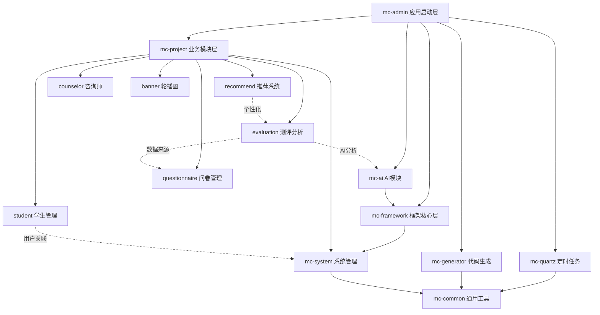

# MindCampus 高校学生心理健康智能干预平台 - 项目结构文档

## 📋 项目概述

**项目名称**: MindCampus (MC)  
**项目描述**: 高校学生心理健康智能干预平台  
**技术架构**: Spring Boot 3.5.4 + MyBatis Plus + MySQL + Redis + 阿里云通义千问 AI  
**Java 版本**: 17  
**项目版本**: 3.9.0

---

## 🏗️ 整体架构

MindCampus 采用模块化分层架构，基于 Maven 多模块管理，遵循经典的 MVC 三层架构模式，并集成 AI 智能分析能力。

### 架构层次

```
┌─────────────────────────────────────────────────────────┐
│                    前端层 (mc-ui)                        │
│              Web端(Vue3) + 移动端(Uni-app)               │
└─────────────────────────────────────────────────────────┘
                            ↓
┌─────────────────────────────────────────────────────────┐
│                  控制层 (mc-admin)                       │
│               应用启动入口 + API 接口                     │
└─────────────────────────────────────────────────────────┘
                            ↓
┌─────────────────────────────────────────────────────────┐
│              业务层 (mc-project + mc-system)             │
│          核心业务模块 + 系统管理模块 + AI模块             │
└─────────────────────────────────────────────────────────┘
                            ↓
┌─────────────────────────────────────────────────────────┐
│           框架层 (mc-framework + mc-common)              │
│         核心框架配置 + 通用工具 + 安全认证                │
└─────────────────────────────────────────────────────────┘
                            ↓
┌─────────────────────────────────────────────────────────┐
│         数据层 (MySQL + Redis + MyBatis Plus)            │
│              持久化存储 + 缓存 + ORM 映射                 │
└─────────────────────────────────────────────────────────┘
```

---

## 📦 模块划分

### 核心模块依赖关系

```
mc-admin (Web服务入口)
├── mc-framework (框架核心)
│   └── mc-system (系统管理)
│       └── mc-common (通用工具)
├── mc-project (核心业务)
│   ├── mc-system
│   └── mc-common
├── mc-ai (AI智能分析)
│   └── mc-framework
├── mc-quartz (定时任务)
│   └── mc-common
└── mc-generator (代码生成)
    └── mc-common
```

---

## 🔧 模块详细说明

### 1️⃣ mc-admin (应用启动模块)

**功能**: Web 服务入口，负责应用启动和 API 接口暴露

**核心职责**:
- 应用启动引导 (`RuoYiApplication`)
- 统一接口管理
- API 文档配置 (Swagger/Knife4j)
- 全局异常处理

**主要组件**:
```
mc-admin/
├── RuoYiApplication.java          # Spring Boot 启动类
├── RuoYiServletInitializer.java   # Servlet 容器初始化
└── web/
    ├── controller/
    │   ├── common/                # 通用控制器 (验证码、文件上传)
    │   ├── monitor/               # 系统监控 (日志、缓存、在线用户)
    │   ├── system/                # 系统管理 (用户、角色、权限、菜单)
    │   └── tool/                  # 工具类接口
    └── core/
        └── config/                # Swagger 配置
```

**关键配置**:
- 端口: 8080
- 上下文路径: `/`
- Swagger UI: `/swagger-ui.html`
- Knife4j UI: `/doc.html`

---

### 2️⃣ mc-project (核心业务模块)

**功能**: 心理健康管理核心业务实现

**六大业务子模块**:

#### 📚 student (学生管理)
```java
// 核心实体
Student.java                    # 学生信息
  - studentId                   # 学生ID
  - userId                      # 关联用户ID
  - studentNo                   # 学号
  - name, gender, grade         # 基础信息
  - major, className            # 专业班级
  - phone, status               # 联系方式和状态
```

#### 📝 questionnaire (问卷管理)
```java
// 核心实体
Questionnaire.java              # 问卷主表
  - questionnaireId             # 问卷ID
  - title, description          # 标题描述
  - status, type                # 状态类型
  - totalScore                  # 总分
  - startTime, endTime          # 有效时间

QuestionBank.java               # 题库
Question.java                   # 题目
QuestionnaireAnswer.java        # 答题记录
```

**问卷类型**:
- 0: 常规测评
- 1: 临时测评
- 2: 专项测评
- 3: 学业压力
- 4: 情绪状态
- 5: 人格特质

#### 📊 evaluation (测评分析)
```java
// 核心实体
EvaluationResult.java           # 测评结果
  - resultId                    # 结果ID
  - studentId                   # 学生ID
  - questionnaireId             # 问卷ID
  - totalScore                  # 总得分
  - riskLevel                   # 风险等级 (低/中/高)
  - aiAnalysis                  # AI 分析结果 (JSON)
  - aiStatus                    # AI 分析状态
  - readStatus                  # 已读标识
  - completionStatus            # 完成标识

QuestionnaireAnswer.java        # 答题详情
```

#### 🎯 recommend (推荐系统)
```java
// 核心实体
RecommendArticle.java           # 推荐文章
RecommendCourse.java            # 推荐课程
RecommendMusic.java             # 推荐音乐
```

#### 👨‍⚕️ counselor (咨询师管理)
```java
// 核心实体
CounselorInfo.java              # 咨询师信息
  - 咨询师资质
  - 擅长领域
  - 预约管理
```

#### 🎨 banner (轮播图管理)
```java
// 核心实体
Banner.java                     # 轮播图
  - 图片URL
  - 链接地址
  - 排序状态
```

**模块结构模式** (每个子模块遵循标准分层):
```
[module]/
├── controller/                 # 控制器层 (接收请求)
├── service/                    # 服务层 (业务逻辑)
│   └── impl/                   # 服务实现
├── mapper/                     # 持久层 (数据访问)
└── domain/                     # 实体层 (数据模型)
    ├── dto/                    # 数据传输对象
    └── vo/                     # 视图对象
```

---

### 3️⃣ mc-ai (AI 智能分析模块)

**功能**: 基于阿里云通义千问大模型的智能分析

**核心能力**:
- 心理测评结果智能解读
- 风险等级评估
- 个性化干预建议
- 实时对话支持

**主要组件**:
```java
ChatController.java             # AI 聊天控制器
  - chat()                      # 同步聊天
  - chatStreamContent()         # SSE 流式聊天

EvaluationAiService.java        # 测评 AI 分析服务
AiPromptService.java            # 提示词管理服务

DashScopeAiConfig.java          # 通义千问配置
DashScopeChatConfig.java        # 对话配置
```

**技术栈**:
- Spring AI Alibaba 1.0.0.2
- DashScope API (通义千问)
- Reactor 响应式编程
- SSE (Server-Sent Events) 流式传输

**API 端点**:
- `/chatTest` - 同步聊天
- `/chat/SSEStream` - SSE 流式聊天
- `/chat/stream` - 纯文本流式聊天

---

### 4️⃣ mc-system (系统管理模块)

**功能**: 基础系统功能和权限管理

**核心实体**:
```java
// 用户权限实体
SysUser.java                    # 用户
SysRole.java                    # 角色
SysMenu.java                    # 菜单
SysDept.java                    # 部门
SysPost.java                    # 岗位

// 系统配置实体
SysConfig.java                  # 系统配置
SysDictType.java                # 字典类型
SysDictData.java                # 字典数据
SysNotice.java                  # 通知公告

// 日志实体
SysOperLog.java                 # 操作日志
SysLogininfor.java              # 登录日志
SysUserOnline.java              # 在线用户

// 关联关系实体
SysUserRole.java                # 用户-角色
SysRoleMenu.java                # 角色-菜单
SysUserPost.java                # 用户-岗位
SysRoleDept.java                # 角色-部门
```

**RBAC 权限模型**:
```
用户 (SysUser)
  ↓
角色 (SysRole) ←→ 数据权限 (SysRoleDept)
  ↓
菜单/权限 (SysMenu)
```

---

### 5️⃣ mc-framework (框架核心模块)

**功能**: 系统底层框架支持和基础设施

**核心组件**:

#### 🔒 Security (安全认证)
```
security/
├── context/                    # 安全上下文
├── filter/                     # 安全过滤器
│   └── JwtAuthenticationTokenFilter  # JWT 认证过滤器
└── service/                    # 认证服务
    ├── TokenService            # Token 管理
    ├── UserDetailsServiceImpl  # 用户详情
    └── PermissionService       # 权限校验
```

#### ⚙️ Config (框架配置)
```
config/
├── SecurityConfig.java         # Spring Security 配置
├── DruidConfig.java            # 数据源配置
├── RedisConfig.java            # Redis 配置
├── MybatisPlusConfig.java      # MyBatis Plus 配置
├── SwaggerConfig.java          # API 文档配置
├── ResourcesConfig.java        # 静态资源配置
├── ThreadPoolConfig.java       # 线程池配置
└── FilterConfig.java           # 过滤器配置
```

#### 🎯 AOP (切面编程)
```
aspectj/
├── LogAspect.java              # 日志切面
├── DataScopeAspect.java        # 数据权限切面
├── DataSourceAspect.java       # 动态数据源切面
└── RateLimiterAspect.java      # 限流切面
```

---

### 6️⃣ mc-common (通用工具模块)

**功能**: 全局共享的工具类和基础组件

**核心包结构**:

#### 📌 Annotation (注解)
```java
@Log                            # 操作日志
@Excel                          # Excel 导入导出
@DataScope                      # 数据权限
@RateLimiter                    # 接口限流
@RepeatSubmit                   # 防重复提交
@Anonymous                      # 匿名访问
@Sensitive                      # 敏感信息
```

#### 🏛️ Core Domain (核心领域对象)
```java
// 基础实体
BaseEntity.java                 # 基础实体 (createTime, updateTime, remark)
BaseEntityPlus.java             # 增强实体 (MyBatis Plus)
TreeEntity.java                 # 树形实体
TreeSelect.java                 # 树形选择器

// 统一响应
AjaxResult.java                 # Ajax 响应对象
R.java                          # 通用响应对象

// 核心实体
entity/
├── SysUser.java                # 用户实体
├── SysRole.java                # 角色实体
├── SysMenu.java                # 菜单实体
├── SysDept.java                # 部门实体
├── SysDictType.java            # 字典类型
└── SysDictData.java            # 字典数据

// 模型对象
model/
├── LoginBody.java              # 登录请求体
├── LoginUser.java              # 登录用户信息
└── RegisterBody.java           # 注册请求体
```

#### 🛠️ Utils (工具类)
```
utils/
├── SecurityUtils.java          # 安全工具类 (密码加密、获取当前用户)
├── ServletUtils.java           # Servlet 工具类
├── StringUtils.java            # 字符串工具类
├── DateUtils.java              # 日期工具类
├── DictUtils.java              # 字典工具类
├── MessageUtils.java           # 消息国际化
├── PageUtils.java              # 分页工具类
├── ExceptionUtil.java          # 异常工具类
├── bean/                       # Bean 工具
├── file/                       # 文件工具
├── poi/                        # Excel 工具
├── ip/                         # IP 工具
├── http/                       # HTTP 工具
├── sign/                       # 签名工具
└── uuid/                       # UUID 工具
```

---

### 7️⃣ mc-quartz (定时任务模块)

**功能**: 基于 Quartz 的分布式定时任务调度

**主要组件**:
```
quartz/
├── config/                     # Quartz 配置
├── domain/                     # 任务实体
│   ├── SysJob.java             # 定时任务
│   └── SysJobLog.java          # 任务日志
├── controller/                 # 任务管理接口
├── service/                    # 任务服务
├── task/                       # 具体任务实现
└── util/                       # 任务工具类
```

---

### 8️⃣ mc-generator (代码生成模块)

**功能**: 基于数据库表结构自动生成 CRUD 代码

**生成内容**:
- Controller (控制器)
- Service + ServiceImpl (服务层)
- Mapper + XML (持久层)
- Domain (实体类)
- 前端 Vue 页面
- SQL 菜单脚本

---

### 9️⃣ mc-ui (前端界面模块)

#### 🖥️ MindCampus-Web (后台管理系统)

**技术栈**:
- Vue 3 + Vite
- Element Plus
- Pinia (状态管理)
- Vue Router
- Axios

#### 📱 MindCampus-App (移动端应用)

**技术栈**:
- Uni-app (多端统一开发)
- Vue 3
- uni-ui 组件库

---

## 📊 核心实体类清单

### 业务实体 (mc-project)

| 模块 | 实体类 | 说明 | 关键字段 |
|------|--------|------|----------|
| **学生管理** | `Student` | 学生信息 | studentId, userId, studentNo, name, gender, grade, major, className |
| **问卷管理** | `Questionnaire` | 问卷主表 | questionnaireId, title, type, status, totalScore, startTime, endTime |
| | `Question` | 题目信息 | questionId, content, type, options, score |
| | `QuestionBank` | 题库 | bankId, title, description, category |
| | `QuestionnaireAnswer` | 答题记录 | answerId, studentId, questionnaireId, answers |
| **测评分析** | `EvaluationResult` | 测评结果 | resultId, studentId, questionnaireId, totalScore, riskLevel, aiAnalysis |
| **推荐系统** | `RecommendArticle` | 推荐文章 | articleId, title, content, category |
| | `RecommendCourse` | 推荐课程 | courseId, title, instructor, duration |
| | `RecommendMusic` | 推荐音乐 | musicId, title, artist, category |
| **咨询师** | `CounselorInfo` | 咨询师信息 | counselorId, name, specialty, qualification |
| **轮播图** | `Banner` | 轮播图 | bannerId, imageUrl, linkUrl, sort |

### 系统实体 (mc-system)

| 模块 | 实体类 | 说明 | 关键字段 |
|------|--------|------|----------|
| **用户管理** | `SysUser` | 用户信息 | userId, userName, nickName, email, phone, status |
| | `SysRole` | 角色信息 | roleId, roleName, roleKey, dataScope |
| | `SysMenu` | 菜单权限 | menuId, menuName, parentId, path, component, perms |
| | `SysDept` | 部门信息 | deptId, deptName, parentId, orderNum, leader |
| | `SysPost` | 岗位信息 | postId, postCode, postName, postSort |
| **系统配置** | `SysConfig` | 参数配置 | configId, configName, configKey, configValue |
| | `SysDictType` | 字典类型 | dictId, dictName, dictType |
| | `SysDictData` | 字典数据 | dictCode, dictSort, dictLabel, dictValue |
| | `SysNotice` | 通知公告 | noticeId, noticeTitle, noticeType, noticeContent |
| **日志监控** | `SysOperLog` | 操作日志 | operId, title, businessType, method, requestMethod |
| | `SysLogininfor` | 登录日志 | infoId, userName, ipaddr, loginLocation, loginTime |
| | `SysUserOnline` | 在线用户 | tokenId, userName, ipaddr, loginTime, expireTime |

### AI 实体 (mc-ai)

| 模块 | 实体类 | 说明 | 关键字段 |
|------|--------|------|----------|
| **AI 分析** | `EvaluationAIResult` | AI分析结果 | resultId, analysis, suggestions, riskAssessment |

---

## 🗂️ 完整项目树状结构

```
MindCampus/
│
├── 📱 mc-ui/                                   # 前端项目
│   ├── MindCampus-Web/                        # 后台管理系统 (Vue3)
│   │   ├── src/
│   │   │   ├── views/                         # 页面视图
│   │   │   ├── components/                    # 公共组件
│   │   │   ├── api/                           # API 接口封装
│   │   │   ├── router/                        # 路由配置
│   │   │   ├── store/                         # Pinia 状态管理
│   │   │   └── utils/                         # 工具函数
│   │   └── vite.config.js                     # Vite 配置
│   │
│   └── MindCampus-App/                        # 移动端应用 (Uni-app)
│       ├── pages/                             # 页面
│       │   ├── index/                         # 首页
│       │   ├── questionnaire/                 # 问卷测评
│       │   ├── evaluation/                    # 测评结果
│       │   ├── recommend/                     # 推荐内容
│       │   ├── counselor/                     # 心理咨询
│       │   └── mine/                          # 个人中心
│       └── manifest.json                      # 应用配置
│
├── 🚀 mc-admin/                               # 应用启动模块
│   └── src/main/
│       ├── java/com/mc/
│       │   ├── RuoYiApplication.java          # ⭐ Spring Boot 启动类
│       │   └── web/controller/
│       │       ├── common/                    # 通用接口
│       │       ├── monitor/                   # 系统监控
│       │       ├── system/                    # 系统管理
│       │       └── tool/                      # 工具接口
│       └── resources/
│           ├── application.yml                # ⚙️ 主配置文件
│           └── mybatis/mybatis-config.xml     # MyBatis 配置
│
├── 💼 mc-project/                             # 核心业务模块
│   └── src/main/java/com/mc/
│       ├── 👤 student/                        # 学生管理
│       │   ├── controller/
│       │   ├── service/impl/
│       │   ├── mapper/
│       │   └── domain/Student.java
│       │
│       ├── 📝 questionnaire/                  # 问卷管理
│       │   ├── controller/
│       │   ├── service/impl/
│       │   ├── mapper/
│       │   └── domain/
│       │       ├── Questionnaire.java
│       │       ├── Question.java
│       │       ├── QuestionBank.java
│       │       └── QuestionnaireAnswer.java
│       │
│       ├── 📊 evaluation/                     # 测评分析
│       │   ├── controller/
│       │   ├── service/impl/
│       │   ├── mapper/
│       │   └── domain/
│       │       ├── EvaluationResult.java
│       │       └── QuestionnaireAnswer.java
│       │
│       ├── 🎯 recommend/                      # 推荐系统
│       │   ├── controller/
│       │   ├── service/impl/
│       │   ├── mapper/
│       │   └── domain/
│       │       ├── RecommendArticle.java
│       │       ├── RecommendCourse.java
│       │       └── RecommendMusic.java
│       │
│       ├── 👨‍⚕️ counselor/                      # 咨询师管理
│       │   └── domain/CounselorInfo.java
│       │
│       └── 🎨 banner/                         # 轮播图管理
│           └── domain/Banner.java
│
├── 🤖 mc-ai/                                  # AI 智能分析模块
│   └── src/main/java/com/mc/ai/
│       ├── ChatController.java                # ⭐ AI 聊天控制器
│       ├── config/
│       │   ├── DashScopeAiConfig.java
│       │   └── DashScopeChatConfig.java
│       └── service/
│           ├── EvaluationAiService.java
│           └── AiPromptService.java
│
├── 🔧 mc-system/                              # 系统管理模块
│   └── src/main/
│       ├── java/com/mc/system/
│       │   ├── domain/
│       │   │   ├── SysConfig.java
│       │   │   ├── SysLogininfor.java
│       │   │   ├── SysOperLog.java
│       │   │   ├── SysNotice.java
│       │   │   ├── SysPost.java
│       │   │   └── SysUserOnline.java
│       │   ├── service/impl/
│       │   └── mapper/
│       └── resources/mapper/system/
│
├── 🏗️ mc-framework/                           # 框架核心模块
│   └── src/main/java/com/mc/framework/
│       ├── 🔒 security/                       # 安全认证
│       │   ├── filter/JwtAuthenticationTokenFilter.java
│       │   └── service/
│       │       ├── TokenService.java
│       │       ├── UserDetailsServiceImpl.java
│       │       └── PermissionService.java
│       │
│       ├── ⚙️ config/                          # 框架配置
│       │   ├── SecurityConfig.java
│       │   ├── DruidConfig.java
│       │   ├── RedisConfig.java
│       │   └── MybatisPlusConfig.java
│       │
│       ├── 🎯 aspectj/                        # AOP 切面
│       │   ├── LogAspect.java
│       │   ├── DataScopeAspect.java
│       │   ├── DataSourceAspect.java
│       │   └── RateLimiterAspect.java
│       │
│       └── 🌐 web/                            # Web 层
│           ├── exception/GlobalExceptionHandler.java
│           └── service/
│               ├── SysLoginService.java
│               └── SysRegisterService.java
│
├── 🧰 mc-common/                              # 通用工具模块
│   └── src/main/java/com/mc/common/
│       ├── 📌 annotation/                     # 注解
│       │   ├── Log.java
│       │   ├── Excel.java
│       │   ├── DataScope.java
│       │   ├── RateLimiter.java
│       │   └── RepeatSubmit.java
│       │
│       ├── 🏛️ core/domain/                    # 核心领域对象
│       │   ├── BaseEntity.java
│       │   ├── BaseEntityPlus.java
│       │   ├── AjaxResult.java
│       │   ├── R.java
│       │   ├── entity/
│       │   │   ├── SysUser.java
│       │   │   ├── SysRole.java
│       │   │   ├── SysMenu.java
│       │   │   ├── SysDept.java
│       │   │   ├── SysDictType.java
│       │   │   └── SysDictData.java
│       │   └── model/
│       │       ├── LoginBody.java
│       │       ├── LoginUser.java
│       │       └── RegisterBody.java
│       │
│       ├── 🛠️ utils/                          # 工具类
│       │   ├── SecurityUtils.java
│       │   ├── ServletUtils.java
│       │   ├── StringUtils.java
│       │   ├── DateUtils.java
│       │   ├── bean/
│       │   ├── file/
│       │   ├── poi/
│       │   ├── ip/
│       │   └── http/
│       │
│       ├── 🚫 exception/                      # 异常定义
│       │   ├── ServiceException.java
│       │   ├── GlobalException.java
│       │   ├── user/
│       │   ├── file/
│       │   └── job/
│       │
│       ├── 🔧 filter/                         # 过滤器
│       │   ├── XssFilter.java
│       │   ├── RepeatableFilter.java
│       │   └── RefererFilter.java
│       │
│       ├── 📊 constant/                       # 常量定义
│       │   ├── Constants.java
│       │   ├── HttpStatus.java
│       │   ├── UserConstants.java
│       │   └── CacheConstants.java
│       │
│       └── 🔢 enums/                          # 枚举类型
│           ├── BusinessType.java
│           ├── BusinessStatus.java
│           ├── DataSourceType.java
│           └── UserStatus.java
│
├── ⏰ mc-quartz/                              # 定时任务模块
│   └── src/main/java/com/mc/quartz/
│       ├── domain/
│       │   ├── SysJob.java
│       │   └── SysJobLog.java
│       ├── controller/
│       ├── service/impl/
│       ├── mapper/
│       ├── task/
│       └── util/
│
├── 🔨 mc-generator/                           # 代码生成模块
│   └── src/main/
│       ├── java/com/mc/generator/
│       │   ├── domain/
│       │   │   ├── GenTable.java
│       │   │   └── GenTableColumn.java
│       │   ├── controller/
│       │   ├── service/impl/
│       │   ├── mapper/
│       │   └── util/
│       └── resources/vm/                      # Velocity 模板
│
├── 📚 sql/                                    # 数据库脚本
│   ├── ry_20250522.sql
│   ├── quartz.sql
│   └── fix_evaluation_result_duplicate.sql
│
├── 🔧 bin/                                    # 执行脚本
│   ├── run.bat
│   ├── package.bat
│   └── clean.bat
│
├── pom.xml                                    # ⚙️ 主 POM 文件
└── README.md                                  # 项目说明文档
```

---

## 🔗 模块间关系图



---

## 🛠️ 技术栈总览

### 后端技术

| 技术 | 版本 | 说明 |
|------|------|------|
| Spring Boot | 3.5.4 | 核心框架 |
| Spring Security | 6.x | 安全认证 |
| MyBatis Plus | 3.5.10 | ORM 框架 |
| MySQL | 8.2.0 | 关系数据库 |
| Redis | - | 缓存数据库 |
| Druid | 1.2.23 | 数据库连接池 |
| JWT | 0.9.1 | Token 生成 |
| FastJson | 2.0.58 | JSON 处理 |
| Quartz | - | 定时任务 |
| Spring AI Alibaba | 1.0.0.2 | AI 集成 |
| Knife4j | 4.4.0 | API 文档 |
| PageHelper | 2.1.1 | 分页插件 |
| POI | 4.1.2 | Excel 处理 |
| Velocity | 2.3 | 代码生成模板 |

### 前端技术

| 技术 | 说明 |
|------|------|
| Vue 3 | 前端框架 |
| Vite | 构建工具 |
| Element Plus | UI 组件库 |
| Pinia | 状态管理 |
| Vue Router | 路由管理 |
| Axios | HTTP 客户端 |
| Uni-app | 多端开发框架 |
| uni-ui | Uni-app 组件库 |

---

## 📈 业务流程说明

### 1. 用户认证流程

```
登录请求 → SysLoginController
    ↓
验证用户名密码 → UserDetailsServiceImpl
    ↓
生成 JWT Token → TokenService
    ↓
存储到 Redis → RedisCache
    ↓
返回 Token 给前端
```

### 2. 问卷测评流程

```
学生选择问卷 → QuestionnaireController
    ↓
加载题目 → QuestionService
    ↓
提交答案 → QuestionnaireAnswerService
    ↓
计算分数 → EvaluationResultService
    ↓
触发 AI 分析 → EvaluationAiService
    ↓
保存测评结果 → EvaluationResult
    ↓
推送通知给管理员
```

### 3. AI 分析流程

```
获取测评结果 → EvaluationResult
    ↓
构建分析提示词 → AiPromptService
    ↓
调用通义千问 API → DashScope
    ↓
解析 AI 响应 → EvaluationAiService
    ↓
更新 aiAnalysis 字段
    ↓
计算风险等级 → riskLevel
```

### 4. 权限验证流程

```
请求到达 → JwtAuthenticationTokenFilter
    ↓
提取 Token → TokenService.getLoginUser()
    ↓
验证 Token 有效性
    ↓
加载用户权限 → PermissionService
    ↓
检查数据权限 → DataScopeAspect
    ↓
执行业务逻辑
```

---

## 🔐 安全机制

### 1. 认证机制
- **JWT Token**: 无状态认证
- **Redis 缓存**: Token 存储和验证
- **密码加密**: BCrypt 加密
- **验证码**: Kaptcha 图形验证码

### 2. 权限控制
- **RBAC 模型**: 用户-角色-菜单三级权限
- **数据权限**: 基于部门的数据范围控制
- **注解权限**: `@PreAuthorize` 方法级权限
- **菜单权限**: 动态菜单加载

### 3. 安全防护
- **XSS 防护**: XssFilter + XssHttpServletRequestWrapper
- **SQL 注入**: MyBatis 参数化查询
- **CSRF 防护**: Token 验证
- **防盗链**: RefererFilter
- **接口限流**: RateLimiterAspect
- **防重复提交**: RepeatSubmitInterceptor

---

## 🚀 快速开始

### 1. 环境要求
- JDK 17+
- MySQL 8.0+
- Redis 5.0+
- Maven 3.6+
- Node.js 16+ (前端)

### 2. 数据库初始化
```sql
-- 执行主数据库脚本
source sql/ry_20250522.sql;

-- 执行定时任务脚本
source sql/quartz.sql;
```

### 3. 后端启动
```bash
# 修改配置文件
# mc-admin/src/main/resources/application.yml
# 配置数据库连接、Redis、AI API Key

# 启动应用
mvn clean package
java -jar mc-admin/target/mc-admin.jar

# 或使用启动脚本
bin/run.bat
```

### 4. 前端启动

**Web 端**:
```bash
cd mc-ui/MindCampus-Web
npm install
npm run dev
```

**移动端**:
```bash
cd mc-ui/MindCampus-App
# 使用 HBuilderX 打开项目运行
```

### 5. 访问系统
- 后台管理: http://localhost:80
- API 文档: http://localhost:8080/doc.html
- 默认账号: admin/admin123

---

## 📝 开发规范

### 1. 代码分层
```
Controller 层: 接口定义，参数验证
    ↓
Service 层: 业务逻辑，事务控制
    ↓
Mapper 层: 数据访问，SQL 执行
    ↓
Domain 层: 实体定义，数据模型
```

### 2. 命名规范
- **实体类**: 大驼峰，如 `Student`, `EvaluationResult`
- **接口**: I 开头，如 `IStudentService`
- **实现类**: Impl 结尾，如 `StudentServiceImpl`
- **Controller**: Controller 结尾
- **Mapper**: Mapper 结尾
- **DTO/VO**: 明确后缀，如 `StudentDTO`, `StudentVO`

### 3. 注解使用
```java
@Log(title = "学生管理", businessType = BusinessType.INSERT)
@PreAuthorize("@ss.hasPermi('student:info:add')")
@PostMapping
public AjaxResult add(@Validated @RequestBody Student student)
```

### 4. 统一响应
```java
// 成功
return AjaxResult.success();
return AjaxResult.success(data);

// 失败
return AjaxResult.error("错误信息");

// 分页
return getDataTable(list);
```

---

## 🎯 核心功能特性

### 1. 心理测评系统
- ✅ 多类型问卷支持 (常规/临时/专项/学业/情绪/人格)
- ✅ 题库管理和题目复用
- ✅ 在线答题和自动计分
- ✅ 测评结果记录和查询
- ✅ 风险等级自动评估

### 2. AI 智能分析
- ✅ 基于通义千问的智能分析
- ✅ 个性化干预建议生成
- ✅ 流式对话支持
- ✅ 历史记录管理

### 3. 学生管理
- ✅ 学生信息管理
- ✅ 班级专业管理
- ✅ 状态监控

### 4. 推荐系统
- ✅ 文章推荐
- ✅ 课程推荐
- ✅ 音乐推荐

### 5. 咨询管理
- ✅ 咨询师信息管理
- ✅ 预约管理

### 6. 系统管理
- ✅ 用户权限管理 (RBAC)
- ✅ 部门岗位管理
- ✅ 字典配置管理
- ✅ 操作日志审计
- ✅ 在线用户监控
- ✅ 服务器监控
- ✅ 缓存监控

---

## 📊 数据库设计要点

### 核心表结构

```sql
-- 学生信息表
student_info (student_id, user_id, student_no, name, ...)

-- 问卷表
questionnaire (questionnaire_id, title, type, status, ...)

-- 题库表
question_bank (bank_id, title, category, ...)

-- 题目表
question (question_id, bank_id, content, type, options, ...)

-- 测评结果表
evaluation_result (result_id, student_id, questionnaire_id, 
                   total_score, risk_level, ai_analysis, ...)

-- 答题记录表
questionnaire_answer (answer_id, student_id, questionnaire_id,
                      question_id, answer, ...)

-- 推荐资源表
recommend_article (article_id, title, content, ...)
recommend_course (course_id, title, instructor, ...)
recommend_music (music_id, title, artist, ...)

-- 咨询师表
counselor_info (counselor_id, name, specialty, ...)

-- 轮播图表
banner (banner_id, image_url, link_url, sort, ...)
```

---

## 🔄 扩展建议

### 1. 功能扩展
- 在线心理咨询 (WebSocket 实时通讯)
- 数据统计分析看板
- 心理危机预警系统
- 家长端小程序
- 第三方系统对接 (学工系统、教务系统)

### 2. 性能优化
- Redis 缓存策略优化
- 数据库索引优化
- 静态资源 CDN 加速
- 接口响应时间监控
- 异步任务处理

### 3. 安全加固
- 敏感数据加密存储
- 操作审计日志
- 异常登录检测
- API 接口签名验证
- 定期安全漏洞扫描

---

## 📞 联系方式

**项目地址**: http://www.caidu.edu.cn  
**开发团队**: MindCampus Team  
**版本**: 3.9.0  
**最后更新**: 2025-11-18

---

## 📄 许可证

本项目仅供学习和研究使用。

---

**文档生成时间**: 2025-11-18  
**文档版本**: v1.0
